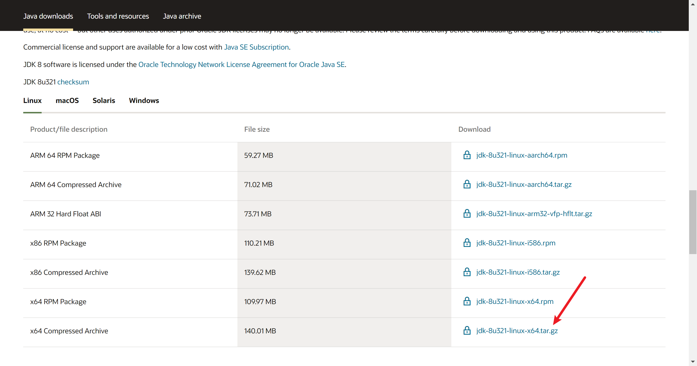
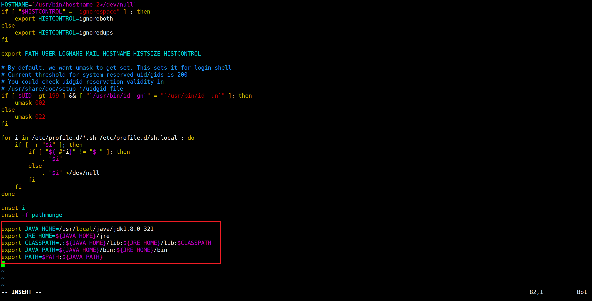
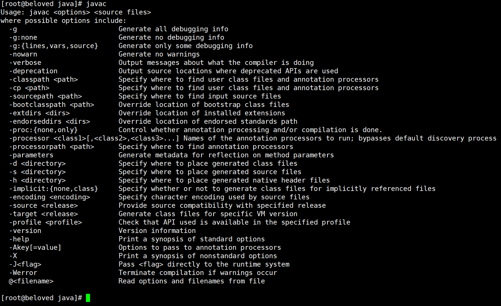
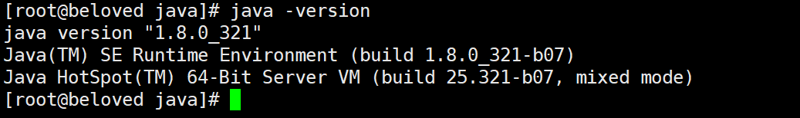

#
# JDK安装

## 1、下载jdk8

> 下载地址：https://www.oracle.com/java/technologies/javase/javase-jdk8-downloads.html



## 2、解压安装
`/usr/local`下创建java目录，上传jdk源码包


使用解压命令解压

```bash
tar -zxvf jdk-8u321-linux-x64.tar.gz 
```

解压完成顺手删除源码包

```bash
rm -f jdk-8u321-linux-x64.tar.gz
```


## 3、配置环境变量

`/etc/profile`文件是Liunx环境变量相关配置，jdk环境变量在此配置

```bash
vim /etc/profile
```


按 i 进入编辑模式，在文件末尾添加如下内容

```bash
export JAVA_HOME=/usr/local/java/jdk1.8.0_321  #jdk安装目录
 
export JRE_HOME=${JAVA_HOME}/jre
 
export CLASSPATH=.:${JAVA_HOME}/lib:${JRE_HOME}/lib:$CLASSPATH
 
export JAVA_PATH=${JAVA_HOME}/bin:${JRE_HOME}/bin
 
export PATH=$PATH:${JAVA_PATH}
```



`Esc +  :wq`  保存退出

通过命令source /etc/profile让profile文件立即生效

```bash
source /etc/profile
```

## 4、测试

```bash
javac
```



```bash
java -version
```


