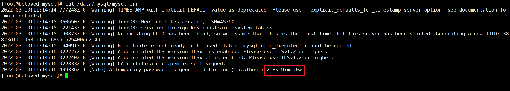

#  

# 卸载mysql

## 1、检查是否安装mysql

```bash
rpm -qa|grep -i mysql
```

显示之前安装了：

```bash
MySQL-client-5.5.25a-1.rhel5

MySQL-server-5.5.25a-1.rhel5
```

停止mysql服务、删除之前安装的mysql

删除命令：`rpm -e –nodeps 包名`

```bash
rpm -ev MySQL-client-5.5.25a-1.rhel5
rpm -ev MySQL-server-5.5.25a-1.rhel5 
```

## 2、查找mysql目录

>  查找mysql的目录，并且删除mysql的文件和库（现在很多都是使用编译的mysql安装包进行安装的，所以查找文件是必须的

```bash
find / -name mysql
```

查找结果如下（根据个人实际情况）：

```bash
/etc/selinux/targeted/active/modules/100/mysql
/usr/share/mysql
/usr/lib64/mysql
```

删除对应的mysql目录

```bash
rm -rf /etc/selinux/targeted/active/modules/100/mysql
rm -rf /usr/share/mysql
rm -rf /usr/lib64/mysql
```

> **注意：/etc/my.cnf不会删除，需要进行手工删除**

```bash
rm -rf /etc/my.cnf
```

## 3、检查是否卸载成功

**再次查找机器是否安装mysql（注意！！！检查文件情况是必须的 注意！！！）**

检查安装情况

```bash
rpm -qa|grep -i mysql
```

检查mysql文件情况

```bash
find / -name mysql 
```

**无结果说明卸载（删除）彻底。**

# 安装mysql

## 1、下载源码包

>  下载地址：https://dev.mysql.com/downloads/mysql/

根据需求下载对应的版本。


## 2、解压安装

上传源码包到`/usr/local`目录，使用解压命令解压。

```shell
tar -xvf mysql-5.7.37-linux-glibc2.12-x86_64.tar.gz 
```

解压完成顺手删除源码包，为了方便可修改解压后目录

```bash
rm -f mysql-5.7.37-linux-glibc2.12-x86_64.tar.gz 
mv mysql-5.7.37-linux-glibc2.12-x86_64/ mysql
```


## 3、卸载Mariadb

> 卸载系统自带的Mariadb，防止和mysql冲突

```bash
[root@beloved /]# rpm -qa|grep mariadb
mariadb-libs-5.5.68-1.el7.x86_64
[root@beloved /]# rpm -e --nodeps mariadb-libs-5.5.68-1.el7.x86_64
[root@beloved /]# rpm -qa|grep mariadb
```


## 3、创建用户并给数据目录赋予权限

> 检查mysql组和用户是否存在，如无创建

```bash
cat /etc/group | grep mysql 
cat /etc/passwd | grep mysql
```

> 创建mysql组和用户

```bash
groupadd mysql
useradd -r -g mysql mysql
```

> 创建mysq数据目录

```bash
# mysql数据会存储在 /data/mysql 目录下
mkdir -p /data/mysql
```

> 赋予权限

```bash
chown mysql:mysql -R /data/mysql
```


## 4、配置my.cnf文件

```bash
vim /etc/my.cnf
```

```bash
[mysqld]
# 监听地址
# bind-address=127.0.0.1 #只允许本机访问。
# bind-address=某个网卡的ip #例如bind-address=192.168.1.101，只能通过ip为192.168.1.101的网卡访问。
# bind-address=0.0.0.0 #此规则是系统默认配置，监听所有网卡，即允许所有ip访问。
bind-address=0.0.0.0
# 端口
port=3306
# 启动mysql的用户
user=mysql
# 安装目录
basedir=/usr/local/mysql
# 数据存放目录
datadir=/data/mysql
# 指定socket文件
socket=/tmp/mysql.sock
# 日志文件
log-error=/data/mysql/mysql.err
pid-file=/data/mysql/mysql.pid

# 允许最大连接数
max_connections=2000
# 打开定时任务
event_scheduler=ON
# 数据库默认字符集
character_set_server=utf8mb4
# 是否对sql语句大小写敏感，1表示不敏感
lower_case_table_names = 1
# SQL数据包发送的大小，如果有BLOB对象建议修改成1G
max_allowed_packet = 128M
```

> 参考文档：
>
> - [my.cnf 配置详解](https://www.cnblogs.com/yjt1993/p/11039067.html)
> - [bind-address 配置详解](https://www.cnblogs.com/valley-yyds/p/15625091.html)


## 5、初始化数据库

进入mysql安装bin目录，初始化mysql。

```bash
cd /usr/local/mysql/bin/

# --defaults-file 配置文件
# --basedir	安装目录
# --datadir 数据存放目录
# --user	mysql使用用
./mysqld --defaults-file=/etc/my.cnf --basedir=/usr/local/mysql/ --datadir=/data/mysql/ --user=mysql --initialize
```

查看随机临时密码。

```bash
cat /data/mysql/mysql.err
```



> 注意：红色框的是初始化生成的随机临时密码，保存记住

## 6、启动mysql

> **将mysql.server放置到/etc/init.d/mysql中，并设置权限**

```bash
cp /usr/local/mysql/support-files/mysql.server /etc/init.d/mysqld

chown 777 /etc/my.cnf 
# 设置可执行权限 
chmod +x /etc/init.d/mysqld
```

> **启动mysql，并查看是否启动成功**

```bash
# 启动服务
service mysqld start
# 关闭服务
service mysqld stop
# 重启服务
service mysqld restart
# 检查服务
ps -ef|grep mysql
```


> 添加开机自启

```bash
# 添加服务
chkconfig --add mysqld
# 查看服务列表
chkconfig --list
```


3、4、5状态为开或者为 on 则表示成功。如果是 关或者 off 则执行：

```bash
chkconfig --level 345 mysqld on
```

---

> 映射mysql执行命令

```bash
ln -s /usr/local/mysql/bin/mysql /usr/bin/mysql
```

> 链接mysql并修改初始密码

```bash
mysql -uroot -p
# 输入生成的随机密码进行连接
```


> 修改密码进行刷新

```sql
SET PASSWORD = PASSWORD('123456');
 
ALTER USER 'root'@'localhost' PASSWORD EXPIRE NEVER;
 
flush privileges;
```


# 配置远程连接

## 1、开启远程连接

> 修改用户连接权限

```sql
mysql> use mysql	# 切换数据库
Database changed
mysql> select host,user from user;	# 查看用户
+-----------+---------------+
| host      | user          |
+-----------+---------------+
| localhost | mysql.session |
| localhost | mysql.sys     |
| localhost | root          |
+-----------+---------------+
3 rows in set (0.00 sec)

mysql> update user set host='%' where user='root';	# 修改用户连接权限
Query OK, 1 row affected (0.00 sec)
Rows matched: 1  Changed: 1  Warnings: 0

mysql> FLUSH  PRIVILEGES;	# 更新
Query OK, 0 rows affected (0.00 sec)

mysql> select host,user from user;
+-----------+---------------+
| host      | user          |
+-----------+---------------+
| %         | root          |
| localhost | mysql.session |
| localhost | mysql.sys     |
+-----------+---------------+
3 rows in set (0.00 sec)

mysql> 

```

> 添加用户

```bash
create user 'username'@'%' identified by 'password';  这里 @‘%’ 表示在任何主机都可以登录
```

> **注意：如果防火墙开启还要开放对应端口，云主机还需要开放对应策略组**

## 2、测试连接


