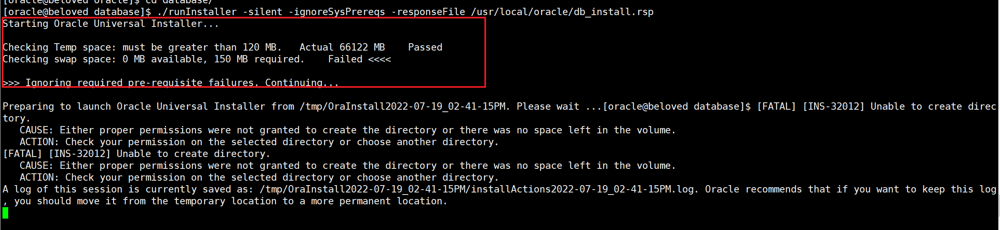
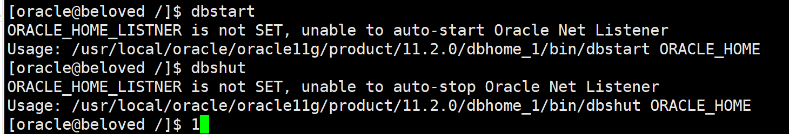
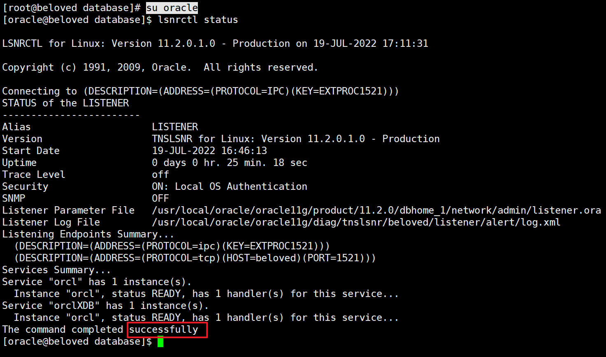
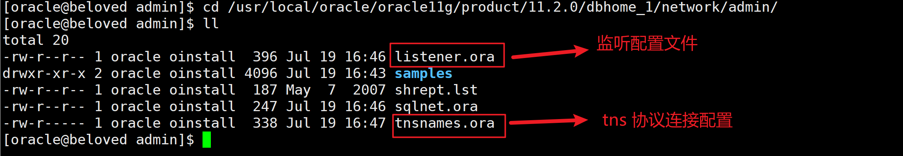

# 
# Oracle11g安装

> 参考链接：
>
> - https://juejin.cn/post/6859361230973960205#heading-11
> - https://www.codeleading.com/article/61383126050/

## 安装依赖包

```bash
yum install -y automake autotools-dev binutils bzip2 elfutils expat \
gawk gcc gcc-multilib g++-multilib lib32ncurses5 lib32z1 \
ksh less lib32z1 libaio1 libaio-dev libc6-dev libc6-dev-i386 \
libc6-i386 libelf-dev libltdl-dev libodbcinstq4-1 libodbcinstq4-1:i386 \
libpth-dev libpthread-stubs0-dev libstdc++5 make openssh-server rlwrap \
rpm sysstat unixodbc unixodbc-dev unzip x11-utils zlibc unzip cifs-utils \
libXext.x86_64  glibc.i686
```

## 解压Oracle数据库安装包

上传安装包到 `/usr/local/oracle` 目录。按顺序解压安装文件

```bash
unzip linux.x64_11gR2_database_1of2.zip
unzip linux.x64_11gR2_database_2of2.zip
```

## 创建Oracle用户及用户组

创建用户组、用户、设置密码

```bash
groupadd oinstall
groupadd dba
useradd -g oinstall -G dba oracle
passwd oracle
```

授权

```bash
chown oracle:oinstall -R /usr/local/oracle/
```

## 编辑用户限制配置文件

```bash
vim /etc/security/limits.conf
```

在文件的末尾添加如下配置项

```bash
oracle          soft      nproc   2047
oracle          hard      nproc   16384
oracle          soft      nofile  1024
oracle          hard      nofile  65536
oracle          soft      stack   10240
```

## 修改环境变量

切换 `oracle` 用户修改环境变量

```bash
su - oracle
vim ~/.bash_profile
```

在文件末尾添加如下配置项。

```bash
export ORACLE_BASE=/usr/local/oracle/oracle11g
export ORACLE_HOME=$ORACLE_BASE/product/11.2.0/dbhome_1
export ORACLE_SID=orcl
export ORACLE_UNQNAME=orcl
export NLS_LANG=.AL32UTF8
export PATH=${PATH}:${ORACLE_HOME}/bin/:$ORACLE_HOME/lib64
```

环境变量生效

```bash
source ~/.bash_profile
```

## 修改Oracle配置文件

复制文件模板

```bash
cp /usr/local/oracle/database/response/db_install.rsp /usr/local/oracle/
```

对db_install.rsp文件进行编辑

```bash
vim db_install.rsp
```

参考：

- oracle_base与oracle_home目录区别：https://blog.csdn.net/weixin_38618988/article/details/124424114


需要修改的配置项如下所示

```bash
# 指定安装选项
oracle.install.option=INSTALL_DB_AND_CONFIG
# 可以修改成主机名或者域名(IP)
ORACLE_HOSTNAME=localhost
# 指定oracle inventory目录的所有者，通常会是oinstall或者dba
UNIX_GROUP_NAME=oinstall
# 指定产品清单oracle inventory目录的路径
INVENTORY_LOCATION=/usr/local/oracle/oraInventory
# 指定数据库语言，可以选择多个，用逗号隔开。
SELECTED_LANGUAGES=en,zh_CN
# 设置ORALCE_HOME的路径
ORACLE_HOME=/usr/local/oracle/oracle11g/product/11.2.0/dbhome_1
ORACLE_BASE=/usr/local/oracle/oracle11g
# 选择Oracle安装数据库软件的版本
oracle.install.db.InstallEdition=EE
# 指定拥有OSDBA、OSOPER 权限的用户组，通常会是dba组
oracle.install.db.DBA_GROUP=dba
oracle.install.db.OPER_GROUP=oinstall
# 选择数据库的用途，一般用途/事物处理，数据仓库
oracle.install.db.config.starterdb.type=GENERAL_PURPOSE
oracle.install.db.config.starterdb.globalDBName=orcl
oracle.install.db.config.starterdb.SID=orcl
# 字符集
oracle.install.db.config.starterdb.characterSet=AL32UTF8
# 11g的新特性自动内存管理，也就是SGA_TARGET和PAG_AGGREGATE_TARGET都#不用设置了，Oracle会自动调配两部分大小。
oracle.install.db.config.starterdb.memoryOption=true
#指定Oracle自动管理内存的大小，最小是256MB
oracle.install.db.config.starterdb.memoryLimit=1024
# 是否载入模板示例
oracle.install.db.config.starterdb.installExampleSchemas=false
# 设定所有数据库用户使用同一个密码，其它数据库用户就不用单独设置了。长度最小8 一个大写字母小写字母数字
oracle.install.db.config.starterdb.password.ALL=Oracle#123456
# 数据库本地管理工具DB_CONTROL，远程集中管理工具GRID_CONTROL
oracle.install.db.config.starterdb.control=DB_CONTROL
# 是否启用Email通知, 启用后会将告警等信息发送到指定邮箱
oracle.install.db.config.starterdb.dbcontrol.enableEmailNotification=false
# 通知的地址
oracle.install.db.config.starterdb.dbcontrol.emailAddress=
# 设置自动备份
oracle.install.db.config.starterdb.automatedBackup.enable=false
# 自动备份指定使用的文件系统存放数据库文件还是ASM  必须指定要不然默认ASM安装是有ASM密码配置问题
oracle.install.db.config.starterdb.storageType=FILE_SYSTEM_STORAGE
# 使用文件系统存放数据库文件才需要指定数据文件、控制文件、Redo log的存放目录
oracle.install.db.config.starterdb.fileSystemStorage.dataLocation=/usr/local/oracle/oracle11g/oradata
# 使用文件系统存放数据库文件才需要指定备份恢复目录
oracle.install.db.config.starterdb.fileSystemStorage.recoveryLocation=/usr/local/oracle/oracle11g/fast_recovery_area
# False表示不需要设置安全更新，注意，在11.2的静默安装中疑似有一个BUG
# Response File中必须指定为true，否则会提示错误,不管是否正确填写了邮件地址
DECLINE_SECURITY_UPDATES=true
```

## 静默安装

切换 `oracle` 用户

```bash
su - oracle
cd /usr/local/oracle/database
```

执行

``` bash
./runInstaller -silent -ignoreSysPrereqs -responseFile /usr/local/oracle/db_install.rsp
```

安装时可以根据安装提示查看日志

```bash
tail -f /usr/local/oracle/oraInventory/logs/installActions2022-07-19_04-43-33PM.log
```

等待一段时间后，如果输出如下信息，则表明Oracle数据库已经安装成功。

```bash
The following configuration scripts need to be executed as the "root" user. 
 #!/bin/sh 
 #Root scripts to run

/usr/local/oracle/oraInventory/orainstRoot.sh
/usr/local/oracle/oracle11g/product/11.2.0/dbhome_1/root.sh
To execute the configuration scripts:
	 1. Open a terminal window 
	 2. Log in as "root" 
	 3. Run the scripts 
	 4. Return to this window and hit "Enter" key to continue 

Successfully Setup Software.
```

## 完成安装

切换 `root` 用户，根据刚才提示信息，执行命令

```bash
/usr/local/oracle/oraInventory/orainstRoot.sh
/usr/local/oracle/oracle11g/product/11.2.0/dbhome_1/root.sh
```

检查

```bash
ps -ef | grep ora_ | grep -v grep

sqlplus / as sysdba
```

## 安装问题

### Checking swap space: 0 MB available, 150 MB required



```bash
Starting Oracle Universal Installer...

Checking Temp space: must be greater than 120 MB.   Actual 66122 MB    Passed
Checking swap space: 0 MB available, 150 MB required.    Failed <<<<

>>> Ignoring required pre-requisite failures. Continuing...

Preparing to launch Oracle Universal Installer from /tmp/OraInstall2022-07-19_02-41-15PM. Please wait ...[oracle@beloved database]$ [FATAL] [INS-32012] Unable to create directory.
   CAUSE: Either proper permissions were not granted to create the directory or there was no space left in the volume.
   ACTION: Check your permission on the selected directory or choose another directory.
[FATAL] [INS-32012] Unable to create directory.
   CAUSE: Either proper permissions were not granted to create the directory or there was no space left in the volume.
   ACTION: Check your permission on the selected directory or choose another directory.
A log of this session is currently saved as: /tmp/OraInstall2022-07-19_02-41-15PM/installActions2022-07-19_02-41-15PM.log. Oracle recommends that if you want to keep this log, you should move it from the temporary location to a more permanent location.
```

#### 解决方案

增加了swap分区

```bash
dd if=/dev/zero of=/home/swapfile bs=1M count=512
mkswap /home/swapfile
swapon /home/swapfile
```

修改 `/etc/fstab`

```bash
vim /etc/fstab
```

增加

```bash
/home/swapfile swap swap defaults 0 0
```

# 相关命令

Oracle 在 `ORACLE_HOME` 目录下提供了相关命令脚本

## 数据库

提供了两个脚本 `dbstart` 和 `dbshut`用来启动和关闭数据库(包括数据库实例和监听)。



**配置**

```bash
vim /etc/oratab

# 修改
orcl:/usr/local/oracle/oracle11g/product/11.2.0/dbhome_1:N
# 为
orcl:/usr/local/oracle/oracle11g/product/11.2.0/dbhome_1:Y
```

```bash
vim $ORACLE_HOME/bin/dbstart
vim $ORACLE_HOME/bin/dbshut

# 修改
ORACLE_HOME_LISTNER=$1
# 为
ORACLE_HOME_LISTNER=$ORACLE_HOME
```

## 监听相关

> 切换用户前要加 `-` 

```bash
# 开启监听
lsnrctl start
# 关闭监听
lsnrctl stop
# 查看监听
lsnrctl status
```


# 配置远程连接

## 查看监听是否打开

切换至 `oracle` 用户查看监听

```bash
su oracle


lsnrctl status
```



successfully，表示监听正常运行

## 配置监听文件

```bash
cd /usr/local/oracle/oracle11g/product/11.2.0/dbhome_1/network/admin/
```



```bash
vim listener.ora
```

```bash
# listener.ora Network Configuration File: /usr/local/oracle/oracle11g/product/11.2.0/dbhome_1/network/admin/listener.ora
# Generated by Oracle configuration tools.

SID_LIST_LISTENER =
  (SID_LIST =
    (SID_DESC =
      (SID_NAME = orcl)
      (ORACLE_HOME = /usr/local/oracle/oracle11g/product/11.2.0/dbhome_1)
      (GLOBAL_HOME = orcl)
    )
  )

LISTENER =
  (DESCRIPTION_LIST =
    (DESCRIPTION =
      (ADDRESS = (PROTOCOL = IPC)(KEY = EXTPROC1521))
      (ADDRESS = (PROTOCOL = TCP)(HOST = beloved)(PORT = 1521))
    )
  )
  
ADR_BASE_LISTENER = /usr/local/oracle/oracle11g
```

```bash
vim tnsnames.ora
```

```bash
# tnsnames.ora Network Configuration File: /usr/local/oracle/oracle11g/product/11.2.0/dbhome_1/network/admin/tnsnames.ora
# Generated by Oracle configuration tools.

LISTENER_ORCL = 
  (ADDRESS = (PROTOCOL = TCP)(HOST = beloved)(PORT = 1521))
  
ORCL =
  (DESCRIPTION =
    (ADDRESS = (PROTOCOL = TCP)(HOST = beloved)(PORT = 1521))
    (CONNECT_DATA =
      (SERVER = DEDICATED)
      (SERVICE_NAME = orcl)
    )
  )
```

重启监听
