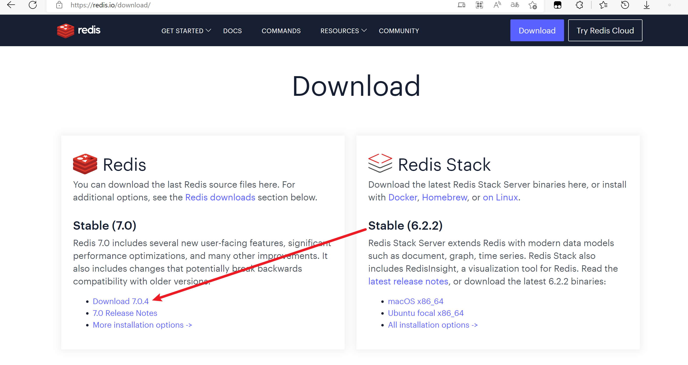
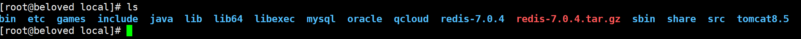
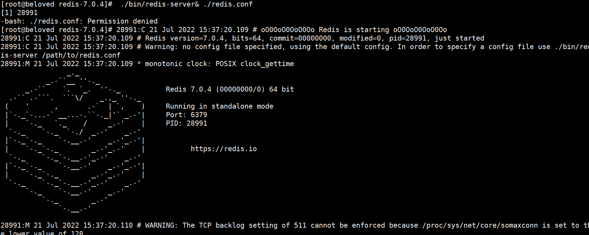

# 

# Redis安装

## 1、下载

> [官网下载地址](https://redis.io/download/#redis-downloads)，此处是 7.0.4



## 2、准备GCC

安装 redis 需要 `gcc` 环境，没有需要进行安装

```bash
gcc -v  # 查看版本

yum -y install gcc  # 安装
```

## 3、编译安装

上传源码包到`/usr/local`目录，使用解压命令解压。

```bash
tar -zxvf redis-7.0.4.tar.gz
```



进入 `redis-7.0.4` 解压目录里，执行编译命令

```bash
make
```


## 4、安装

进入 `/usr/local/redis-7.0.4/src` 目录执行以下命令进行安装

```bash
make install
```


## 5、启动测试

```bash
./bin/redis-server ./redis.conf
# 或 `&` 表示已后台方式运行
./bin/redis-server& ./redis.conf
```



## 6、连接测试

```bash
./bin/redis-cli -h ip -p port -a password
```


# 自定义配置

> 参考文档：
>
> - https://blog.csdn.net/qq_56892136/article/details/125115022
> - https://www.cnblogs.com/laiyw/p/15173172.html

将默认配置文件移动到安装目录得 `etc` 目录下，后续其余端口的配置也可以放在这里。

```bash
mkdir /usr/local/redis-7.0.4/etc
mv redis.conf /usr/local/redis-7.0.4/etc/
```

## 后台启动

`redis.conf`

默认 no 不以守护进程的方式运行，yes 启动守护进程

```bash
daemonize yes
```

## 端口

`redis.conf`

默认端口：6379

```bash
port 6379
```

## 绑定主机地址（远程连接）

`redis.conf`

- 默认只允许本机连接
- 可配置多个连接地址

- 如果需要远程连接注释此配置即可

```bash
bind 127.0.0.1 -::1
```

## 设置密码

默认是注释的没有密码，根据需求设置密码

方式一：修改 `redis.conf` 配置文件，需要重启 `redis` 服务

```bash
requirepass foobared
```

方式二：运行命令，不需要重启服务

```bash
# 查看当前密码
config get requirepass
# 设置密码
config set requirepass password
```

## 开机启动

```bash
vim /etc/rc.local
```

增加 `redis` 启动命令

```bash
/usr/local/redis-7.0.4/bin/redis-server /usr/local/redis-7.0.4/etc/redis.conf 
```

## 指令配置

将 `redis-server`，`redis-cli` 拷贝到 ` /usr/local/bin/` 下

指令可以在任意目录下直接使用

```bash
cp /usr/local/redis-7.0.4/bin/redis-server /usr/local/bin/
cp /usr/local/redis-7.0.4/bin/redis-cli /usr/local/bin/
```

# 检测 Redis

检测后台进程是否存在

```bash
ps -ef |grep redis
```

检测6379端口是否在监听

```bash
netstat -lntp | grep 6379
```

杀死进程

```bash
kill -9 pid
```

停止 redis

```bash
pkill redis
```


