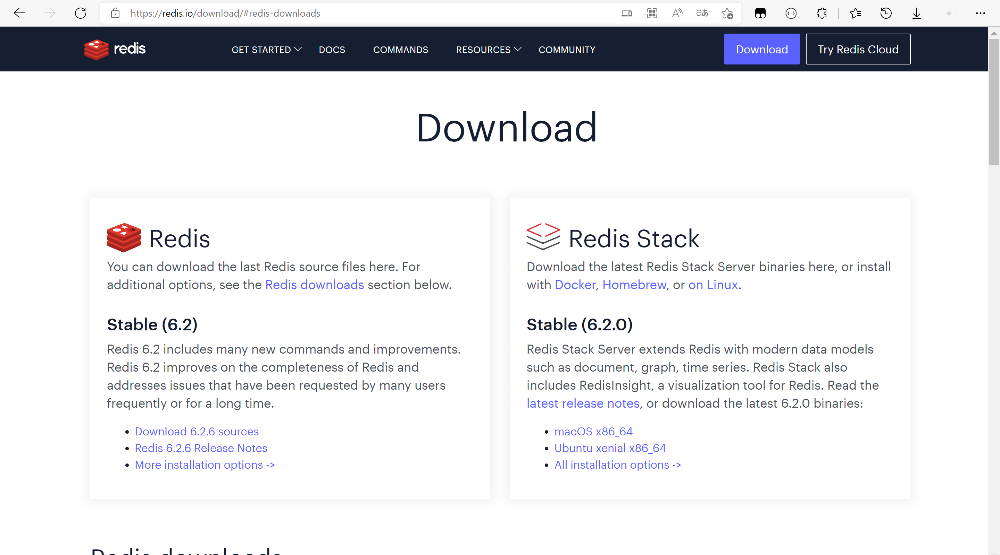
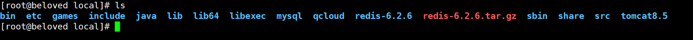

# 

# Redis安装

## 1、下载

> [官网下载地址](https://redis.io/download/#redis-downloads)，此处是 6.2.6



## 2、编译安装

上传源码包到`/usr/local`目录，使用解压命令解压。

```bash
tar -zxvf redis-6.2.6.tar.gz
```



进入 redis-6.2.6 解压目录里，执行编译命令

```bash
make
```

