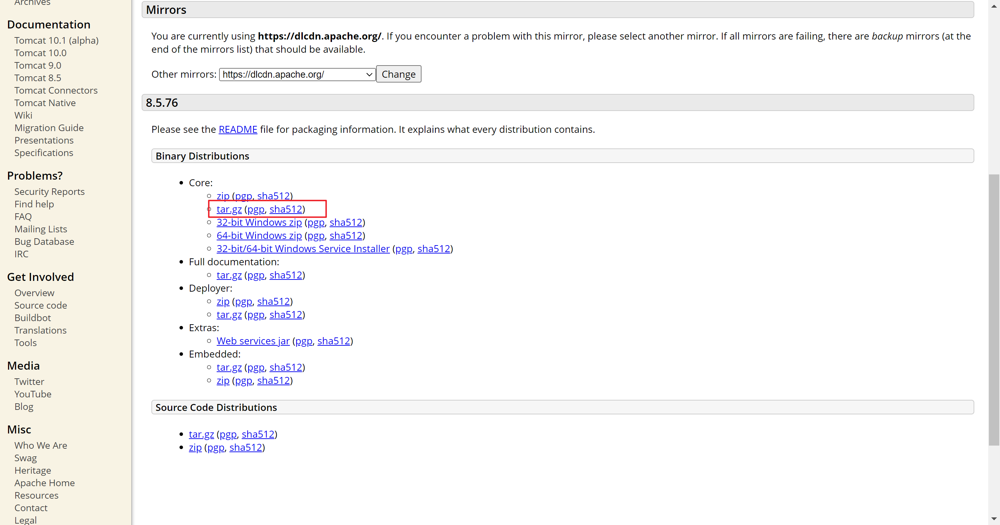
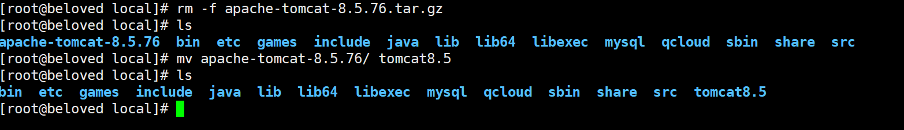
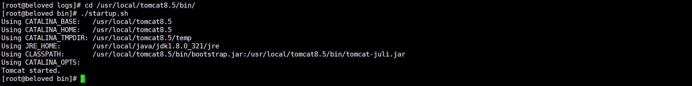
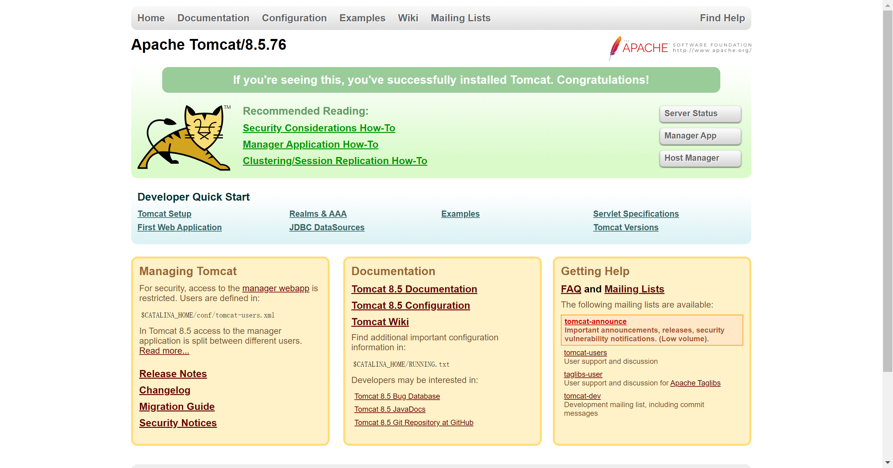
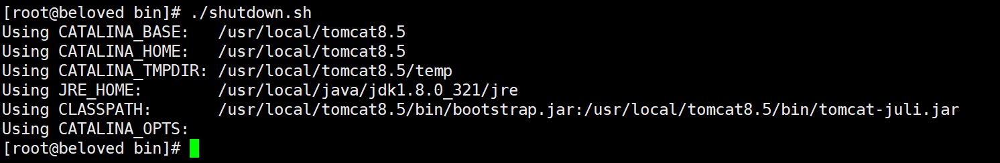
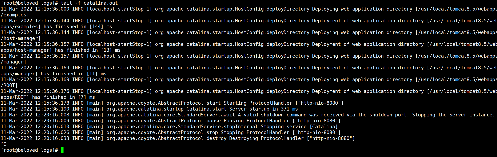

# 

# Tomcat安装

## 1、下载安装包

> [官网下载地址](https://tomcat.apache.org/download-80.cgi)，根据需求下载对应版本



## 2、解压安装

上传源码包到`/usr/local`目录，使用解压命令解压。

```bash
tar -zxvf apache-tomcat-8.5.76.tar.gz 
```

解压完成顺手删除源码包，为了方便可修改解压后目录

```bash
rm -f apache-tomcat-8.5.76.tar.gz 
mv apache-tomcat-8.5.76/ tomcat8.5
```



## 3、启动测试

切换到 tomcat 安装目录的 bin 目录下

> 启动

```bash
./startup.sh
```





> 关闭

```bash
./shutdown.sh
```



> 需要被外网访问需要[开启防火墙端口](/src/Linux/基础/README?id=_6、防火墙)，云主机还需要开启对应的安全组


# 查看实时日志

进入 tomcat 安装目录下的 `logs` 目录

此目录下的 `catalina.out` 文件记录的就是运行时各种信息，即可查看实时日志

```bash
tail -f catalina.out
```

`Ctrl` + `c` 即可推出



