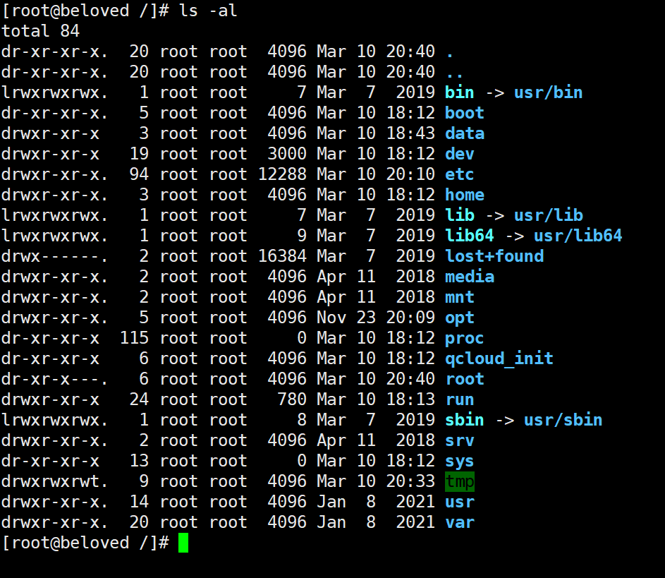
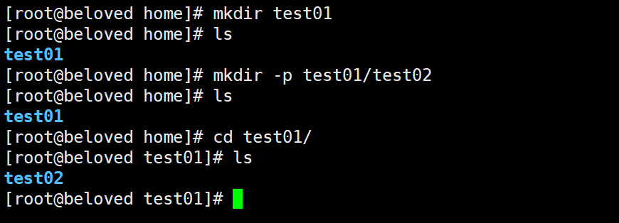
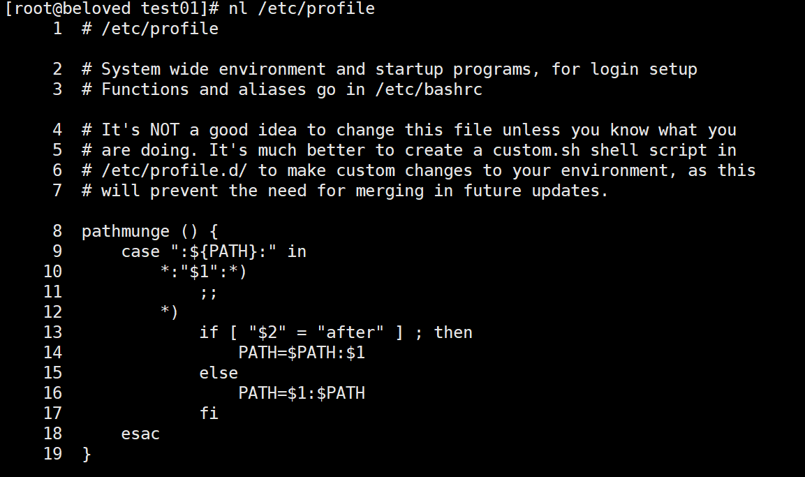
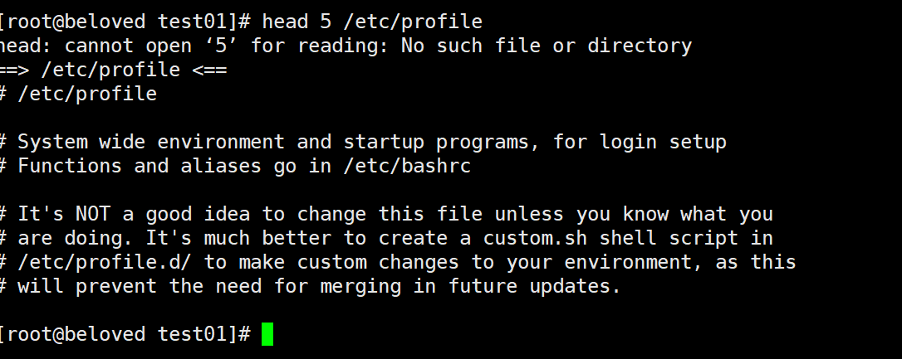

# 

# 1、目录说明

`cd /`：切换到系统根目录

`ls /`：查看目录


> [参考文档](https://blog.csdn.net/qq_33858250/article/details/81839619)

# 2、常用命令

`cd`：切换目录命令

`./`：当前目录

`cd..`：返回上一级目录

`ls`：列出目录

- `-a`：all 查看全部文件包括隐藏文件

- `-l`：列出所有文件，包含文件的属性和权限，没有隐藏文件

- 可以组合使用



`clear`：清屏

`pwd`：显示用户当前所在的目录

`mkdir`：创建目录

- `-p`：创建多级目录



`rmdir`：：删除目录，仅可以删除空的目录，下面有文件，需要先删除文件

- `-p`：删除多个目录

`cp`：复制文件或目录

`rm`：删除文件或目录

- `-f`：忽略不存在的文件，不会出现警告，强制删除
- `-r`：删除多级目录
- `-i`：删除询问是否删除
- **rm -rf /      删除系统中的所有文件**

`mv`：移动或重命名

- `-f`：强制
- `-u`：只替换已经更新过的文件

`ifconfig`：查看网络信息

# 3、压缩、解压

- tar命令

  ```bash
  # 解压
  tar zxvf FileName.tar
  
  # 压缩
  tar czvf FileName.tar DirName
  ```

- gz命令

  ```bash
  # 解压
  gunzip FileName.gz
  gzip -d FileName.gz
  
  # 压缩
  gzip FileName
  ```
  
  >  `.tar.gz`  和  `.tgz`
  
  ```bash
  # 解压
  tar zxvf FileName.tar.gz
  
  # 压缩
  tar zcvf FileName.tar.gz DirName
  
  # 压缩多个文件
  tar zcvf FileName.tar.gz DirName1 DirName2 DirName3 ...
  ```

- bz2命令

  ```bash
  # 解压
  bzip2 -d FileName.bz2
  bunzip2 FileName.bz2
  
  # 压缩
  bzip2 -z FileName
  ```
  
  >  .tar.bz2
  
  ```bash
  # 解压
  tar jxvf FileName.tar.bz2
  
  # 压缩
  tar jcvf FileName.tar.bz2 DirName
  ```

- bz命令

  ```bash
  # 解压
  bzip2 -d FileName.bz
  bunzip2 FileName.bz
  ```

  > .tar.bz

  ```bash
  # 解压
  tar jxvf FileName.tar.bz
  ```

- Z命令

  ```bash
  # 解压
  uncompress FileName.Z
  
  # 压缩
  compress FileName
  ```

  > .tar.Z
  
  ```bash
  # 解压
  tar Zxvf FileName.tar.Z
  
  # 压缩
  tar Zcvf FileName.tar.Z DirName
  ```

- zip命令

  ```bash
  # 解压
  unzip FileName.zip
  
  # 压缩
  zip FileName.zip DirName
  ```

# 4、文件内容查看

- `cat`：由第一行开始显示文件内容

- `tac`：从最后一行开始显示，是`cat`的倒写

- `nl`：显示的时候，输出行号

  

- `more`：分页显示    空格翻页   Enter下一行   :f显示当前行号

- `less`：与`more`类是，可以向前翻页  上下键翻页    q退出

- `head`：只看头几行

  

- `tall`：只看后几行

**`man`可以查看命令的使用文档，如：`man tall`**

# 5、进程管理

`ps`：查看当前系统中正在执行的各种进程信息

`ps -xx`:

- `-a` ：显示当前终端运行的所有进程信息（当前的进程一个）
- `-u`：以用户的信息展示进程
- `-x`：显示后台运行进程的参数

`pa -aux`：查看所有的进程

`|`：Linux中是管道符。比如`A|B`：将A查询到的数据给B使用

`grep`：查找文件中符合条件的字符串

```bash
ps -aux|grep java # 查看Java相关的进程
ps -aux|grep mysql # 查看mysql相关的进程
```

**`ps -ef`查看父进程**

比如`ps -ef|grep java`查看java相关的父进程。一般使用文件树查看

`pstree -pu`：

- `-p`：显示父id
- `-u`：显示用户组

**结束进程**

`kill -9  进程id`

# 6、防火墙

1.首先查看防火墙状态

```
firewall-cmd --state
```

下图所示为防火墙处于关闭中


2.开启防火墙，启动firewall

```
systemctl start firewalld.service
```

3.设置开机自启

```
systemctl enable firewalld.service
```

4.重启防火墙服务

```
systemctl restart firewalld.service
```

5.检查防火墙状态是否打开

```
firewall-cmd --state
```

如下图显示防火墙已打开：


6.开启特定端口的方法：

```
在开启防火墙之后，我们有些服务就会访问不到，是因为服务的相关端口没有打开。
在此以打开8080端口为例（开放端口+重启防火墙 → 该端口生效）；
命令：
```

开端口命令：firewall-cmd --zone=public --add-port=8080/tcp --permanent
重启防火墙：systemctl restart firewalld.service

命令含义：

--zone #作用域

--add-port=80/tcp #添加端口，格式为：端口/通讯协议

--permanent #永久生效，没有此参数重启后失效

7.查看开启的所有的端口的方法：

```
firewall-cmd --list-all
```

>  [参考文档](https://www.linuxidc.com/Linux/2019-06/159104.htm)