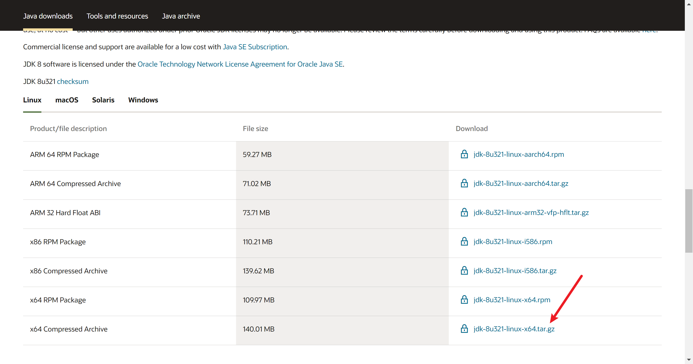
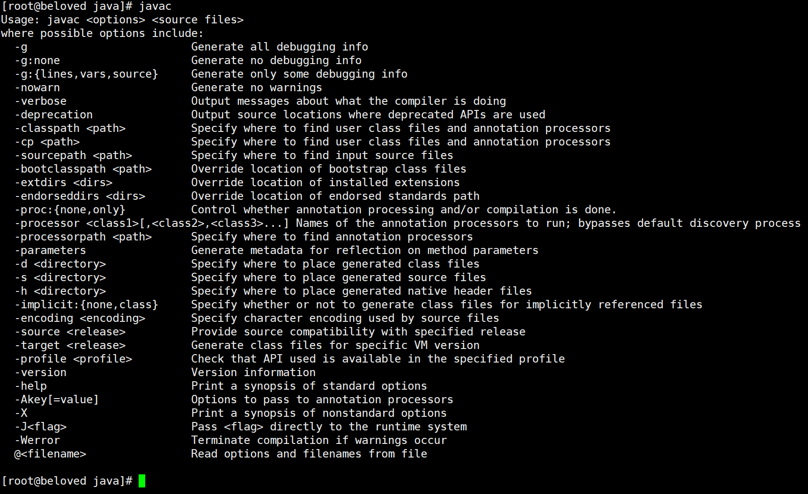

## 主机名修改
- **hostname**：查看主机名，临时主机名。
- **hostnamectl**：查看主机信息，永久主机名。
- **hostnamectl set-hostname Beloved**：修改主机名，是对/etc/hostname文件的内容进行修改。

```shell
[root@VM-4-15-centos ~]# hostname
VM-4-15-centos
[root@VM-4-15-centos ~]# hostnamectl
   Static hostname: VM-4-15-centos
         Icon name: computer-vm
           Chassis: vm
        Machine ID: 2915efb164fb4e7eb14b4b1bf5e1b104
           Boot ID: 4353e726c7894cf69119a7e0363b9570
    Virtualization: kvm
  Operating System: CentOS Linux 7 (Core)
       CPE OS Name: cpe:/o:centos:centos:7
            Kernel: Linux 3.10.0-1160.45.1.el7.x86_64
      Architecture: x86-64
[root@VM-4-15-centos ~]# hostnamectl set-hostname Beloved
[root@VM-4-15-centos ~]# hostname
beloved
```


# JDK安装

## 1、下载jdk8

**下载地址**：https://www.oracle.com/java/technologies/javase/javase-jdk8-downloads.html



## 2、解压安装
`/usr/local`下创建Java目录，上传jdk源码包


使用解压命令解压

```bash
[root@beloved java]# tar -zxvf jdk-8u321-linux-x64.tar.gz 
```

解压完成顺手删除源码包

```bash
[root@beloved java]# rm -f jdk-8u321-linux-x64.tar.gz
```


## 3、配置环境变量

`/etc/profile`文件是Liunx环境变量相关配置，jdk环境变量在此配置

```bash
[root@beloved java]# vim /etc/profile
```


按 i 进入编辑模式，在文件末尾添加如下内容

```bash
export JAVA_HOME=/usr/local/java/jdk1.8.0_321  #jdk安装目录
 
export JRE_HOME=${JAVA_HOME}/jre
 
export CLASSPATH=.:${JAVA_HOME}/lib:${JRE_HOME}/lib:$CLASSPATH
 
export JAVA_PATH=${JAVA_HOME}/bin:${JRE_HOME}/bin
 
export PATH=$PATH:${JAVA_PATH}
```


`Esc +  :wq`  保存退出

通过命令source /etc/profile让profile文件立即生效

```bash
[root@beloved java]# source /etc/profile
```

## 4、测试

```bash
[root@beloved java]# javac
```



```bash
[root@beloved java]# java -version
```


