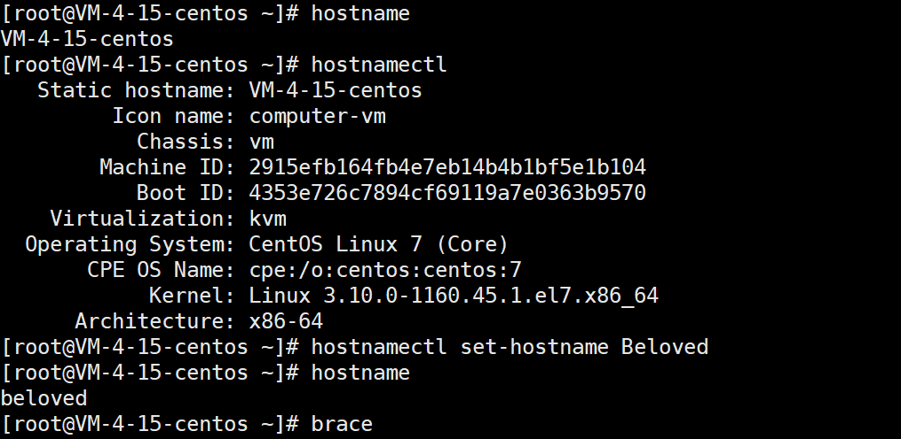

#
# 主机名修改
- **hostname**：查看主机名，临时主机名。
- **hostnamectl**：查看主机信息，永久主机名。
- **hostnamectl set-hostname Beloved**：修改主机名，是对/etc/hostname文件的内容进行修改。

```shell
[root@VM-4-15-centos ~]# hostname
VM-4-15-centos
[root@VM-4-15-centos ~]# hostnamectl
   Static hostname: VM-4-15-centos
         Icon name: computer-vm
           Chassis: vm
        Machine ID: 2915efb164fb4e7eb14b4b1bf5e1b104
           Boot ID: 4353e726c7894cf69119a7e0363b9570
    Virtualization: kvm
  Operating System: CentOS Linux 7 (Core)
       CPE OS Name: cpe:/o:centos:centos:7
            Kernel: Linux 3.10.0-1160.45.1.el7.x86_64
      Architecture: x86-64
[root@VM-4-15-centos ~]# hostnamectl set-hostname Beloved
[root@VM-4-15-centos ~]# hostname
beloved
```



