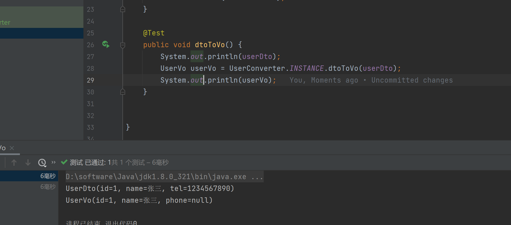

#

# 简介

> 官网：https://mapstruct.org/

`Mapstruct` 实体类映射框架，能够通过Java注解将一个实体类的属性安全地赋值给另一个实体类。只需要定义一个映射器接口，声明需要映射的方法，在编译过程中，mapstruct 会自动生成该接口的实现类，实现将源对象映射到目标对象的效果。

实体类映射框架大致有两种：

- 一种是运行期通过java反射机制动态映射；
- 另一种是编译期动态生成 `getter/setter`，在运行期直接调用框架编译好的 class 类实现实体映射。

 由于mapstruct映射是在编译期间实现的，因此相比运行期的映射框架有以下几个优点：

-  安全性高。因为是编译期就实现源对象到目标对象的映射，如果编译器能够通过，运行期就不会报错；
-  速度快。速度快指的是运行期间直接调用实现类的方法，不会在运行期间使用反射进行转化。

```xml
<!-- 核心包：包含了映射相关的注解，如@Mapper、@Mapping等 -->
<dependency>
    <groupId>org.mapstruct</groupId>
    <artifactId>mapstruct</artifactId>
    <version>1.5.2.Final</version>
</dependency>
<!-- 包含了注解处理器。用于处理注解相关的逻辑，如MappingProcessor等 -->
<dependency>
    <groupId>org.mapstruct</groupId>
    <artifactId>mapstruct-processor</artifactId>
    <version>1.5.2.Final</version>
</dependency>
```

# 整合 Lombok

## 方式一

在`POM` 文件中将 `mapstruct` 坐标放在 `lombok` 坐标之后

```xml
<dependency>
    <groupId>org.projectlombok</groupId>
    <artifactId>lombok</artifactId>
</dependency>

<dependency>
    <groupId>org.mapstruct</groupId>
    <artifactId>mapstruct</artifactId>
    <version>1.5.2.Final</version>
</dependency>
<dependency>
    <groupId>org.mapstruct</groupId>
    <artifactId>mapstruct-processor</artifactId>
    <version>1.5.2.Final</version>
</dependency>
```

## 方式二

使用 `maven` 插件

```xml
<build>
    <pluginManagement>
        <plugins>
            <!-- maven-compiler-plugin 插件，解决 Lombok + MapStruct 组合 -->
            <plugin>
                <groupId>org.apache.maven.plugins</groupId>
                <artifactId>maven-compiler-plugin</artifactId>
                <version>${maven-compiler-plugin.version}</version>
                <configuration>
                    <annotationProcessorPaths>
                        <path>
                            <groupId>org.projectlombok</groupId>
                            <artifactId>lombok</artifactId>
                            <version>${lombok.version}</version>
                        </path>
                        <path>
                            <groupId>org.mapstruct</groupId>
                            <artifactId>mapstruct-processor</artifactId>
                            <version>1.5.2.Final</version>
                        </path>
                        <!-- This is needed when using Lombok 1.18.16 and above -->
                        <path>
                            <groupId>org.projectlombok</groupId>
                            <artifactId>lombok-mapstruct-binding</artifactId>
                            <version>0.2.0</version>
                        </path>
                    </annotationProcessorPaths>
                </configuration>
            </plugin>
        </plugins>
    </pluginManagement>
</build>
```

> **注意：`lombok` 版本在 `1.18.16` 及以上需要添加 `lombok-mapstruct-binding`**

# 映射

## 基本映射

创建 `UserDto` 、`UserVo` 对象，保证属性字段相同

```java
@Data
public class UserDto {
    private int id;
    private String name;   
}
```

```java
@Data
public class UserVo {
    private int id;
    private String name;   
}
```

定义转换得抽象类或者接口并标注 `@Mapper` 注解

```java
@Mapper
public interface UserConverter {
    // 获取对象，调用入口
    UserConverter INSTANCE = Mappers.getMapper(UserConverter.class);

    /**
     * 定义基本转化方法
     *    默认映射规则：同名同类型自动映射
     * @param userDto
     * @return UserVo
     */
    UserVo dtoToVo(UserDto userDto);
}
```

编写测试类

```java
public class TestConverter {
    
    private UserDto userDto = null;
    
    @Before
    public void buildUserDto() {
        userDto = new UserDto();
        userDto.setId(1);
        userDto.setName("张三");
    }
    
    @Test
    public void dtoToVo() {
        System.out.println(userDto);
        UserVo userVo = UserConverter.INSTANCE.dtoToVo(userDto);
        System.out.println(userVo);
    }
   
}
```



生成得实现类

```java
public class UserConverterImpl implements UserConverter {
    public UserConverterImpl() {
    }

    public UserVo dtoToVo(UserDto userDto) {
        if (userDto == null) {
            return null;
        } else {
            UserVo userVo = new UserVo();
            userVo.setId(userDto.getId());
            userVo.setName(userDto.getName());
            return userVo;
        }
    }
}
```

> **注意：**
>
> - `@Mapper` 注解是 `org.mapstruct.Mapper` 包下得，注意和 `Mybatis` 得进行区分
> - 如果使用了 `lombok` 生成得转换实现可能没有属性得 `set` 方法，导致转换后得为类属性为 `null`。
>   - 解决方法 `maven` 引入依赖时将 `lombok` 坐标写在 `mapstruct` 之前就可以
>   - 或者引入 `maven` 插件，参考：https://juejin.cn/post/7099874296373182478

## 不同字段映射

### 不同属性名称

```java
@Data
public class UserDto {
    private int id;
    private String name;
    private String tel;
}
```

```java
@Data
public class UserVo {
    private String id;
    private String name;
    private String phone;
}
```

DTO 中的 `tel` 映射 VO 的 `phone` 属性名不相同需要手动指定映射

> `@Mapping` 注解 `source` 和 `target` 标记分别指向不一致的两个字段

```java
@Mappings({
	@Mapping(source = "tel", target = "phone")
})
UserVo dtoToVo2(UserDto userDto);
```

### 多个源

```java
@Data
public class DeptDto {    
    private int deptId;    
    private String name;
}
```

```java
@Data
public class UserVo {
    private String id;
    private String name;    
    private String phone;  
    private String deptName;
}
```

将 `DeptDto` 的 `name` 映射到 `UserVo` 的 `deptName`

```java
@Mappings({
    @Mapping(source = "userDto.tel", target = "phone"),
    @Mapping(source = "userDto.name", target = "name"),
    @Mapping(source = "deptDto.name", target = "deptName")
})
UserVo dtoToVo3(UserDto userDto, DeptDto deptDto);
```

> **注意：**
>
> - 多个 `@Mapping` 可使用 `@Mappings` 抱起来做一组，也可以不使用 `@Mapping`
> - `source` 可以指定具体的来源类
> - 如果多个源类包含同名字段，必须指定源类否则编译时会抛出异常：Several possible source properties for target property "name" 

## 子对象

```java
@Data
public class HobbyDto {    
    private int id;    
    private String name;
}
```

```java
@Data
public class HobbyVo {
    private int id;
    private String name;   
}
```

```java
@Data
public class UserDto {    
    private int id;    
    private String name;    
    private int age;    
    private String sex;    
    private String tel;    
    private List<HobbyDto> hobbyList;
    private Date dateOfBirth;
}
```

```java
@Data
public class UserVo {
    private String id;
    private String name;    
    private String age;    
    private String phone;    
    private String sex;    
    private String deptName;
    private List<HobbyVo> hobbyList;
    private String dateOfBirth;
}
```

User 的 DTO、VO中各有一个 Hobby 的 DTO、VO。

在 User 转换之前得先需要 `HobbyDto` 和 `HobbyVo` 转换的映射器

```java
@Mapper
public interface HobbyConverter {
    HobbyConverter INSTANCE = Mappers.getMapper(HobbyConverter.class);
    HobbyVo dtoToVo(HobbyDto hobbyDto);
}
```

需要在 `UserConverter` 中引用 `HobbyConverter` 得转换方法。

```java
/**
 * @Mapping：标注是转换器
 *      uses：子对象映射，此转换器可以使用 uses 引用得转换器
 */
@Mapper(uses = {
        HobbyConverter.class
})
public interface UserConverter {
    UserConverter INSTANCE = Mappers.getMapper(UserConverter.class);
    UserVo dtoToVo(UserDto userDto);   
}
```

生成的实现类

```java
public class UserConverterImpl implements UserConverter {

    private final HobbyConverter hobbyConverter = HobbyConverter.INSTANCE;
 
    @Override
    public UserVo dtoToVo(UserDto userDto) {
       
        if ( userDto == null ) {
            return null;
        }

        UserVo userVo = new UserVo();

        userVo.setId( String.valueOf( userDto.getId() ) );
        userVo.setName( userDto.getName() );
        userVo.setAge( String.valueOf( userDto.getAge() ) );
        userVo.setSex( userDto.getSex() );
        userVo.setHobbyList( hobbyDtoListToHobbyVoList( userDto.getHobbyList() ) );
        if ( userDto.getDateOfBirth() != null ) {
            userVo.setDateOfBirth( new SimpleDateFormat().format( userDto.getDateOfBirth() ) );
        }
        return userVo;
    }
    
     protected List<HobbyVo> hobbyDtoListToHobbyVoList(List<HobbyDto> list) {
        if ( list == null ) {
            return null;
        }

        List<HobbyVo> list1 = new ArrayList<HobbyVo>( list.size() );
        for ( HobbyDto hobbyDto : list ) {
            list1.add( hobbyConverter.dtoToVo( hobbyDto ) );
        }

        return list1;
    }
}
```

> `@Mapper` 注解的 `uses` 标志此转换器都可以使用那些转换器

## 枚举映射

```java
public enum PaymentType {
    CASH,
    CHEQUE,
    CARD_VISA,
    CARD_MASTER,
    CARD_CREDIT
}
```

```java
public enum PaymentTypeView {
    CASH,
    CHEQUE,
    CARD
}
```

创建枚举映射接口

> 对于具有不同名称的枚举项需要使用`@ValueMapping`注解
>
> `MappingConstants.ANY_REMAINING` 在目标枚举中找不到相同名称的枚举项,直接转换为对应的另一个枚举项。
>
> `MappingConstants.ANY_UNMAPPED` 直接将所有未通过@ValueMapping注解做显式映射的值都转换为target值

```java
@Mapper
public interface PaymentTypeConverter {

    PaymentTypeConverter INSTANCE = Mappers.getMapper(PaymentTypeConverter.class);

    /**
     * 通过 ValueMapping 直接指定
     * @param paymentType
     * @return
     */
    @ValueMappings({
        @ValueMapping(source = "CARD_VISA", target = "CARD"),
        @ValueMapping(source = "CARD_MASTER", target = "CARD"),
        @ValueMapping(source = "CARD_CREDIT", target = "CARD")
    })
    PaymentTypeView paymentTypeToPaymentTypeView(PaymentType paymentType);

    /**
     * MappingConstants.ANY_REMAINING
     *  在目标枚举中找不到相同名称的枚举项,直接转换为对应的另一个枚举项。
     * @param paymentType
     * @return
     */
    @ValueMapping(source = MappingConstants.ANY_REMAINING, target = "CARD")
    PaymentTypeView paymentTypeToPaymentTypeView2(PaymentType paymentType);

    /**
     * MappingConstants.ANY_UNMAPPED
     * 直接将所有未通过@ValueMapping注解做显式映射的值都转换为target值
     * @param paymentType
     * @return
     */
    @ValueMappings({
        @ValueMapping(source = "CHEQUE", target = "CHEQUE"),
        @ValueMapping(source = MappingConstants.ANY_UNMAPPED, target = "CARD")
    })
    PaymentTypeView paymentTypeToPaymentTypeView3(PaymentType paymentType);
}
```

生成实现

```java
public class PaymentTypeConverterImpl implements PaymentTypeConverter {

    @Override
    public PaymentTypeView paymentTypeToPaymentTypeView(PaymentType paymentType) {
        if ( paymentType == null ) {
            return null;
        }

        PaymentTypeView paymentTypeView;

        switch ( paymentType ) {
            case CARD_VISA: paymentTypeView = PaymentTypeView.CARD;
            break;
            case CARD_MASTER: paymentTypeView = PaymentTypeView.CARD;
            break;
            case CARD_CREDIT: paymentTypeView = PaymentTypeView.CARD;
            break;
            case CASH: paymentTypeView = PaymentTypeView.CASH;
            break;
            case CHEQUE: paymentTypeView = PaymentTypeView.CHEQUE;
            break;
            default: throw new IllegalArgumentException( "Unexpected enum constant: " + paymentType );
        }

        return paymentTypeView;
    }

    @Override
    public PaymentTypeView paymentTypeToPaymentTypeView2(PaymentType paymentType) {
        if ( paymentType == null ) {
            return null;
        }

        PaymentTypeView paymentTypeView;

        switch ( paymentType ) {
            case CASH: paymentTypeView = PaymentTypeView.CASH;
            break;
            case CHEQUE: paymentTypeView = PaymentTypeView.CHEQUE;
            break;
            default: paymentTypeView = PaymentTypeView.CARD;
        }

        return paymentTypeView;
    }

    @Override
    public PaymentTypeView paymentTypeToPaymentTypeView3(PaymentType paymentType) {
        if ( paymentType == null ) {
            return null;
        }

        PaymentTypeView paymentTypeView;

        switch ( paymentType ) {
            case CHEQUE: paymentTypeView = PaymentTypeView.CHEQUE;
            break;
            default: paymentTypeView = PaymentTypeView.CARD;
        }

        return paymentTypeView;
    }
}
```

# 数据类型转换

MapStruct支持`source`和`target`属性之间的数据类型转换。

自动类型转换适用于：

- 基本类型及其对应的包装类之间。比如， `int` 和 `Integer`， `float` 和 `Float`， `long` 和 `Long`，`boolean` 和 `Boolean` 等。
- 任意基本类型与任意包装类之间。如 `int` 和 `long`， `byte` 和 `Integer` 等。
- 所有基本类型及包装类与`String`之间。如 `boolean` 和 `String`， `Integer` 和 `String`， `float` 和 `String` 等。
- 枚举和`String`之间。
- Java大数类型(`java.math.BigInteger`， `java.math.BigDecimal`) 和Java基本类型(包括其包装类)与`String`之间。
- 其它情况详见[MapStruct官方文档](https://mapstruct.org/documentation/stable/reference/html/#implicit-type-conversions)

# 进阶操作

```java
@Mapper(uses = {
        HobbyConverter.class,
        PaymentTypeConverter.class
}, imports = {
        UUID.class 
}, componentModel = "spring")
public interface UserConverter {
    
    // 获取对象
    UserConverter INSTANCE = Mappers.getMapper(UserConverter.class);
    @Mappings({
        @Mapping(target = "id", expression = "java(UUID.randomUUID().toString())"),
        @Mapping(target = "age", constant = "18"),
        @Mapping(source = "sex", target = "sex", defaultValue = "未知"),
        @Mapping(source = "dateOfBirth", target = "dateOfBirth", ignore = true)
    })
    UserVo dtoToVo4(UserDto userDto);
}
```

```java
@Override
public UserVo dtoToVo4(UserDto userDto) {
 
    if ( userDto == null ) {
        return null;
    }

    UserVo userVo = new UserVo();

    if ( userDto.getSex() != null ) {
        userVo.setSex( userDto.getSex() );
    }
    else {
        userVo.setSex( "未知" );
    }
    userVo.setName( userDto.getName() );
    userVo.setHobbyList( hobbyDtoListToHobbyVoList( userDto.getHobbyList() ) );
    userVo.setPaymentType( paymentTypeConverter.paymentTypeToPaymentTypeView( userDto.getPaymentType() ) );

    userVo.setId( UUID.randomUUID().toString() );
    userVo.setAge( "18" );

    return userVo;
}
```

> `@Mapper`：
>
> - `uses`：子对象映射，此转换器可以使用 `uses` 引用得转换器
> - `imports`：表达式需要引用的类
> - `componentModel`：依赖注入。可选值：`spring`、`cdi`、`jsr330`
>
> `@Mapping`：
>
    > - `ignore`：排除映射
>- `constant`：常量 ，无论可以映射什么值都始终是常量值
> 
>- `defaultValue`：如果 source 取值为null，则会使用默认值
> 
>- `expression`：类型一个常量，一直调用定义的 Java 表达式
> 
>- `defaultExpression`：如果 source 取值为null，则会使用表达式
> 
> 注意：表达式中使用的 `Java` 类需要 `@Mapper` 的 `imports` 中引入

## 自定义方法

针对负责特殊业务逻辑的情况可在映射器（接口或抽象类）中定义自定义方法。使用时和其它映射器方法一样

```java
/**
 * 自定义映射方法。可以自定义逻辑处理
 * @param userDto
 * @param deptDto
 * @return
 */
default UserVo dtoToVo5(UserDto userDto, DeptDto deptDto) {
    UserVo userVo = this.dtoToVo2(userDto);
    userVo.setDeptName(deptDto.getName());
    return userVo;
}
```

## 映射前置后置

`@BeforeMapping `、`@AfterMapping`每次映射之前和之后执行

```java
/**
 * @BeforeMapping 每次映射之前执行
 * @param userDto
 */
@BeforeMapping
default void validate(UserDto userDto) {
    if (userDto.getSex() == null) {
        userDto.setSex("未知");
    }
}

/**
 * @AfterMapping 每次映射之后执行
 *      @MappingTarget 表示入参已经是转换之后的
 * @param userVo
 */
@AfterMapping
default void updateResult(@MappingTarget UserVo userVo) {
    userVo.setId(null);
}
```

> 注意：只对自动生成实现的方法起作用自定义方法不起作用

## 继承配置

```java
/**
 * 继承映射配置 @InheritConfiguration
 *      name：需要继承的配置方法名
 * @param userDto
 * @param userVo
 */
@InheritConfiguration(name = "dtoToVo4")
void updateUser(UserDto userDto, @MappingTarget UserVo userVo);
```

> 使用`@InheritConfiguration`注释，避免两个映射器方法的重复配置。
>
> `name` 指定需要继承的配置方法名

## 继承逆向配置

```java
/**
 * 反向映射 @InheritInverseConfiguration
 *      name：需要反向映射的方法名
 * @param userVo
 * @return
 */
@InheritInverseConfiguration(name = "dtoToVo2")
UserDto voToDto(UserVo userVo);
```

> 针对相反的映射配置，可以使用 `@InheritInverseConfiguration` 生成指定配置`source`和 `target`的相反映射