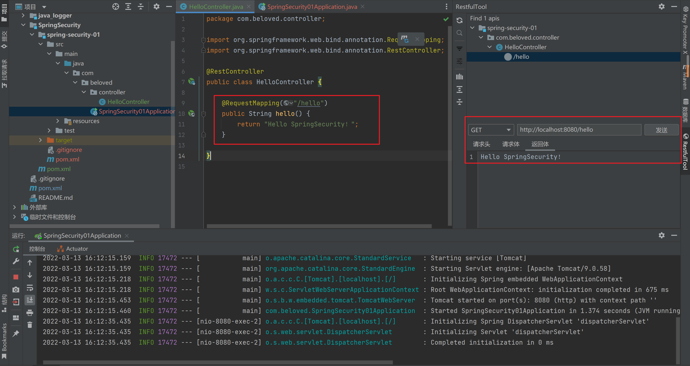
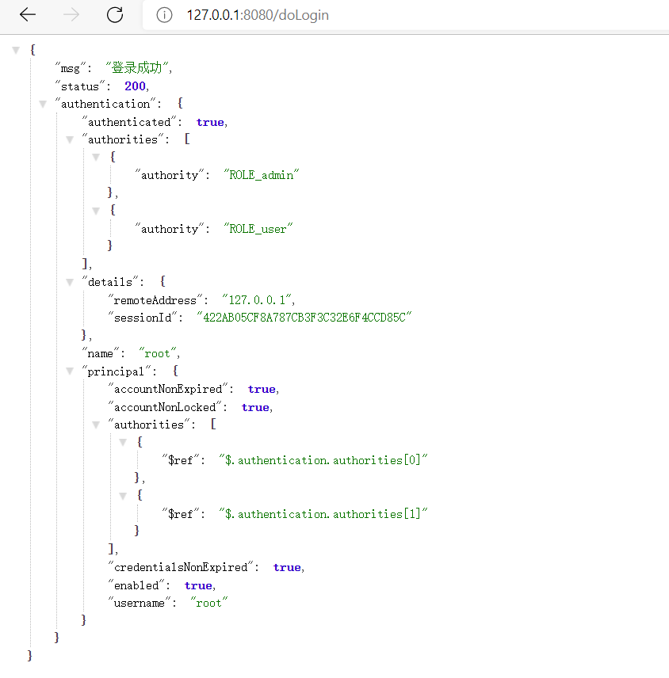

# 

> 官网地址：https://spring.io/projects/spring-security

# 整体架构

在 `SpringSecurity` 的架构设计中，认证 `Authentication` 和授权 `Authorization` 是分开的，无论什么样的认证方式，都不影响授权，两个是独立存在的。


## 认证

### AuthenticationManager

在 SpringSecurity 中认证是由 `AuthenticationManager` 接口来负责的。


```java
public interface AuthenticationManager {
	Authentication authenticate(Authentication authentication) throws AuthenticationException;
}
```

- 返回 `Authentication` 表示认证成功
- 返回 `AuthenticationException` 异常，表示认证失败

AuthenticationManager 主要的实现类为 ProviderManager ，在 ProviderManager 中管理了众多 AuthenticationProvider 实例。在一次完整的认证流程中，SpringSecurity 允许存在多个 AuthenticationProvider，用来实现多种认证方式，这些 AuthenticationProvider 都是由 ProviderManager 进行统一管理。


### Authentication

认证及认证成功的信息主要由 `Authentication` 的实现类进行保存的


- getAuthorities：获取用户权限信息
- getCredentials：获取用户凭证信息，一般指密码
- getDetails：获取用户详细信息
- getPrincipal：获取用户身份信息，用户名，用户对象等
- isAuthenticated：用户是否认证成功

### SecurityContextHolder

SecurityContextHolder 用来获取登录之后用户信息。SpringSecurity 会将登录用户数据保存在 Session 中。当用户登录成后，SpringSecurity 会将登录成功的用户信息保存到 SecurityContextHolder 中。SecurityContextHolder 中的数据保存默认是通过 ThreadLocal 来实现的，使用 ThreadLocal 创建的变量只能被当前线程访问，不能被其他线程访问和修改，也就是用户数据和请求线程绑定在一起。当登录请求处理完毕后，SpringSecurity 会将 SecurityContextHolder 中的数据拿出来保存到 Session 中，同时将 SecurityContexHolder 中的数据清空。以后每当有请求到来时，SpringSecurity 就会先从 Session 中取出用户登录数据，保存到 SecurityContextHolder 中，方便在该请求的后续处理过程中使用，同时在请结束时将 SecurityContextHolder 中的数据拿出来保存到 Session 中，然后将SecurityContextHolder 中的数据清空。这一策略非常方便用户在 Controller、Service 层以及任何代码中获取当前登录用户数据。

## 授权

### AccessDecisionManager

> AccessDecisionManager（访问决策管理器），用来决定此次访问是否被允许


### AccessDecisionVoter

> AccessDecisionVoter（访问决定投票器），投票器会检查用户是否具备应有的角色，进而投出赞成、反对或弃权


AccessDecisionVoter 和 AccessDecisionManager 都有众多的实现类，在 AccessDecisionManager 中会挨个遍历 AccessDecisionVoter，进而决定是否被用户访问，因而 AccessDecisionVoter 和 AccessDecisionManager 两者的关系类似于 AuthenticationProvider 和 ProviderManager 的关系

### ConfigAttribute

> ConfigAttribute：用来保存授权时的角色信息


在 SpringSecurity 中，用户请求一个资源需要的角色会被封装成一个 ConfigAttribute 对象，在 ConfigAttribute 中只有一个 `getAttribute` 方法，该方法返回一个 String 字符串，就是角色的名称。投票器 AccessDecisionVoter 所做的事，就是比较用户所具备的角色和请求资源所需的 ConfigAttribute 的关系。

# 环境搭建

> - SpringBoot
>
> - SpringSecurity

## 创建应用

- 创建 SpringBoot 应用
- 编写测试 Controller
- 启动测试



## 整合 SpringSecurity

**添加依赖**

```xml
<dependency>
    <groupId>org.springframework.boot</groupId>
    <artifactId>spring-boot-starter-security</artifactId>
</dependency>
```

再次启动访问 `/hello` 跳转到一个登录页。


观察控制台生成了一个默认密码。


登录系统：

- 默认用户名：user
- 默认密码：控制台生成


> - 只引入依赖没有任何配置所有请求需要认证？
> - 登录页面从何而来？
> - 默认用户的数据源在哪里？

## 实现原理

> 官网解释：https://docs.spring.io/spring-security/reference/servlet/architecture.html

在 SpringSecurity 中 `认证、授权` 等功能都是基于 `过滤器` 完成的。


默认的过滤器并不是直接放在 Web 项目的原生的过滤器链中，而是通过一个 [FilterChainProxy](https://docs.spring.io/spring-security/reference/servlet/architecture.html#servlet-filterchainproxy) 嵌入到 Web 项目的原生过滤器链中。 [FilterChainProxy](https://docs.spring.io/spring-security/reference/servlet/architecture.html#servlet-filterchainproxy) 作为一个顶层的管理者，将统一管理  [Security Filter](https://docs.spring.io/spring-security/reference/servlet/architecture.html#servlet-security-filters)。[FilterChainProxy](https://docs.spring.io/spring-security/reference/servlet/architecture.html#servlet-filterchainproxy) 本身是通过 Spring 框架提供的 [DelegatingFilterProxy](https://docs.spring.io/spring-security/reference/servlet/architecture.html#servlet-delegatingfilterproxy) 整合到原生的过滤器链中。

## SpringFilters

> https://docs.spring.io/spring-security/reference/servlet/architecture.html#servlet-security-filters

SpringSecurity 提供了非常多的过滤器，其中有的是默认加载的。

| 过滤器                                                       | 作用                                                      | 是否默认 |
| ------------------------------------------------------------ | --------------------------------------------------------- | -------- |
| ChannelProcessingFilter                                      | 过滤请求协议HTTP、HTTPS                                   | NO       |
| `WebAsyncManagerIntegrationFilter`                           | 将 WebAsyncManager 与 SpringSecurity 上下文进行集成       | YES      |
| `SecurityContextPersistenceFilter`                           | 在处理请求之前，将安全信息加载到 SecurityContextHolder 中 | YES      |
| `HeaderWriterFilter`                                         | 处理头信息加入响应中                                      | YES      |
| CorsFilter                                                   | 处理跨域问题                                              | NO       |
| `CsrfFilter`                                                 | 处理 CSRF 攻击                                            | YES      |
| `LogoutFilter`                                               | 处理注销登录                                              | YES      |
| OAuth2AuthorizationRequestRedirectFilter                     | 处理 OAuth2 认证重定向                                    | NO       |
| Saml2WebSsoAuthenticationRequestFilter                       | 处理 SAML 认证                                            | NO       |
| X509AuthenticationFilter                                     | 处理 X509 认证                                            | NO       |
| AbstractPreAuthenticatedProcessingFilter                     | 处理预认证问题                                            | NO       |
| CasAuthenticationFilter                                      | 处理 CAS 单点登录                                         | NO       |
| OAuth2LoginAuthenticationFilter                              | 处理 OAuth2 认证                                          | NO       |
| Saml2WebSsoAuthenticationFilter                              | 处理 SAML 认证                                            | NO       |
| [`UsernamePasswordAuthenticationFilter`](https://docs.spring.io/spring-security/reference/servlet/authentication/passwords/form.html#servlet-authentication-usernamepasswordauthenticationfilter) | 处理表单登录                                              | YES      |
| OpenIDAuthenticationFilter                                   | 处理 OpenID 认证                                          | NO       |
| `DefaultLoginPageGeneratingFilter`                           | 处理默认登录页面                                          | YES      |
| `DefaultLogoutPageGeneratingFilter`                          | 处理默认注销页面                                          | YES      |
| ConcurrentSessionFilter                                      | 处理 Session 有效期                                       | NO       |
| [DigestAuthenticationFilter](https://docs.spring.io/spring-security/reference/servlet/authentication/passwords/digest.html#servlet-authentication-digest) | 处理 HTTP 摘要认证                                        | NO       |
| BearerTokenAuthenticationFilter                              | 处理 OAuth2 认证的 Access Token                           | NO       |
| [`BasicAuthenticationFilter`](https://docs.spring.io/spring-security/reference/servlet/authentication/passwords/basic.html#servlet-authentication-basic) | 处理 HTTPBasic 登录                                       | YES      |
| `RequestCacheAwareFilter`                                    | 处理请求缓存                                              | YES      |
| `SecurityContextHolderAwareRequestFilter`                    | 包装原始请求                                              | YES      |
| JaasApiIntegrationFilter                                     | 处理 JASS 认证                                            | NO       |
| RememberMeAuthenticationFilter                               | 处理 RememberMe 登录                                      | NO       |
| `AnonymousAuthenticationFilter`                              | 处理匿名认证                                              | YES      |
| OAuth2AuthorizationCodeGrantFilter                           | 处理 OAuth2 认证中的授权码                                | NO       |
| `SessionManagementFilter`                                    | 处理 Session 并发问题                                     | YES      |
| [`AccessDeniedExpansion`](https://docs.spring.io/spring-security/reference/servlet/architecture.html#servlet-exceptiontranslationfilter) | 处理认证/授权 中的异常                                    | YES      |
| [`FilterSecurityInterceptor`](https://docs.spring.io/spring-security/reference/servlet/authorization/authorize-requests.html#servlet-authorization-filtersecurityinterceptor) | 处理授权相关                                              | YES      |
| SwitchUserFilter                                             | 处理账户切换                                              | NO       |

SpringSecurity 提供了 32 个过滤器。默认情况下 SpringBoot 在对 SpringSecurity 进入自动化配置是，会创建一个名为 `SpringSecurityFilerChain` 的过滤器，并注入到 Spring 容器，这个过滤器将负责所有的安全管理，包括用户认证、授权、重定向到登录页等。具体可以参考 `WebSecurityConfiguration` 的源码


## SpringBootWebSecurityConfiguration

SpringBoot 对 Security 的自动配置类。

```java
@Configuration(proxyBeanMethods = false)
@ConditionalOnDefaultWebSecurity
@ConditionalOnWebApplication(type = Type.SERVLET)
class SpringBootWebSecurityConfiguration {

   @Bean
   @Order(SecurityProperties.BASIC_AUTH_ORDER)
   SecurityFilterChain defaultSecurityFilterChain(HttpSecurity http) throws Exception {
      http.authorizeRequests().anyRequest().authenticated().and().formLogin().and().httpBasic();
      return http.build();
   }

}
```

默认配置：开启所有请求都拦截 且通过 from 表单方式进行认证

这就是引入 SpringSecurity 没有任何配置 且会拦截的原因。

通过上面的注解可以看出默认生效的条件为：

```java
class DefaultWebSecurityCondition extends AllNestedConditions {

   DefaultWebSecurityCondition() {
      super(ConfigurationPhase.REGISTER_BEAN);
   }

   @ConditionalOnClass({ SecurityFilterChain.class, HttpSecurity.class })
   static class Classes {

   }

   @ConditionalOnMissingBean({ WebSecurityConfigurerAdapter.class, SecurityFilterChain.class })
   static class Beans {

   }

}
```

- 条件一：classpath 中存在 SecurityFilterChain.class, HttpSecurity.class
- 条件二：没有自定义 WebSecurityConfigurerAdapter.class, SecurityFilterChain.class

WebSecurityConfigurerAdapter 这个类极其重要，SpringSecurity 核心配置都在这个类中。


自定义这个类实例，通过覆盖类中方法可达到修改SpringSecurity默认配置，可进行自定义配置。

## 流程分析


1. 请求 /hello 接口，在引入 SpringSecurity 之后会先经过一系列过滤器
2. 在请求到达 FilterSecurityInterceptor 时，发现请求并未认证。请求拦截并抛出 AccessDeniedExpansion 异常。
3. 抛出 AccessDeniedExpansion 异常会被 AccessDeniedExpansion 捕获，这个 Filter 中会调用 LoginUrlAuthenticationEntryPoint 中 commence 方法给客户端返回 302，要求客户端进行重定向到 /login 页面
4. 客户端发送 /login 请求
5. /login 请求会被刺被拦截器中 DefaultLoginPageGeneratingFilter 拦截到，并在拦截其中返回生成的登录页面

就是通过这种方式 SpringSecurity 默认过滤器中生成登录页并返回

## 默认用户生成

> 查看 SpringBootWebSecurityConfiguration#defaultSecurityFilterChain 方法表单登录


> 处理登录为 FormLoginConfigurer 类中，调用 UsernamePasswordAuthenticationFilter 这个类实例


> 查看类中 UsernamePasswordAuthenticationFilter#attemptAuthentication 方法得知实际调用 AuthenticationManager#authenticate 方法


> 调用 ProviderManager#authenticate 方法


> 调用了 ProviderManager 实现类 AbstractUserDetailsAuthenticationProvider#authenticate方法


> 最终调用实现类 DaoAuthenticationProvider 类中方法比较


**==默认实现时基于InMemoryUserDetailsManager这个类，也就是内存的实现==**

## UserDetailsService

通过源码分析 `UserDetailsService` 是顶层父接口，接口中 `loadUserByUsername` 方法是用来认证时进行用户名认证方法，默认的是基于内存实现，如果想要修改成数据库只需要自定义 `UserDetailsService` 实现，最终返回 `UserDetails` 即可。

```java
public interface UserDetailsService {
   UserDetails loadUserByUsername(String username) throws UsernameNotFoundException;
}
```


## UserDetailsServiceAutoConfiguration

```java
@Configuration(proxyBeanMethods = false)
@ConditionalOnClass(AuthenticationManager.class)
@ConditionalOnBean(ObjectPostProcessor.class)
@ConditionalOnMissingBean(
      value = { AuthenticationManager.class, AuthenticationProvider.class, UserDetailsService.class,
            AuthenticationManagerResolver.class },
      type = { "org.springframework.security.oauth2.jwt.JwtDecoder",
            "org.springframework.security.oauth2.server.resource.introspection.OpaqueTokenIntrospector",
            "org.springframework.security.oauth2.client.registration.ClientRegistrationRepository" })
public class UserDetailsServiceAutoConfiguration {

   // ...

   @Bean
   @Lazy
   public InMemoryUserDetailsManager inMemoryUserDetailsManager(SecurityProperties properties,
         ObjectProvider<PasswordEncoder> passwordEncoder) {
      SecurityProperties.User user = properties.getUser();
      List<String> roles = user.getRoles();
      return new InMemoryUserDetailsManager(
            User.withUsername(user.getName()).password(getOrDeducePassword(user, passwordEncoder.getIfAvailable()))
                  .roles(StringUtils.toStringArray(roles)).build());
   }

   // ...

}
```

- 条件一：classpath 下存在 AuthenticationManager 类
- 条件二：系统没有提供 AuthenticationManager.class, AuthenticationProvider.class, UserDetailsService.class,
              AuthenticationManagerResolver.class 实例

默认情况下都会满足，SpringSecurity 会提供一个 InMemoryUserDetailsManager 实例


## SecurityProperties

```java
@ConfigurationProperties(prefix = "spring.security")
public class SecurityProperties {

   // ...
   public static class User {
      private String name = "user";
      private String password = UUID.randomUUID().toString();
      private List<String> roles = new ArrayList<>();
      private boolean passwordGenerated = true;
   }
   // ...
}
```

这就是默认情况下 创建的 user 及 uuid 密码

可以通过配置文件修改内存中的用户信息。

```properties
spring.security.user.name=root
spring.security.user.password=123
spring.security.user.roles=admin,user
```

## 总结

>  AuthenticationManager、ProviderManger、AuthenticationProvider 关系

​	

> WebSecurityConfigurerAdapter 扩展 SpringSecurity 所有默认配置


> UserDetailService 用来修改默认认证的数据源信息


# 自定义认证

## 自定义资源权限规则

- `/index` 公共资源
- `/hello` 需要认证的资源

自定义 `WebSecurityConfigurerAdapter#configure` 方法进行实现

```java
@Configuration
public class WebSecurityConfigurer extends WebSecurityConfigurerAdapter {
	@Override
    protected void configure(HttpSecurity http) throws Exception {
        http.authorizeRequests()
                .mvcMatchers("/index").permitAll()  // 放行资源要写在认证之前
                .anyRequest().authenticated()
                .and()
                .formLogin();
    }
}
```


> mvcMatchers(...)：匹配资源
>
> permitAll()：放行资源，无需认证授权即可访问
>
> anyRequest()：代表所有请求
>
> authenticated()：匹配的资源都需要认证
>
> formLogin()：开启表单认证
>
> **注意：放行资源必须在认证之前！！！**

## 自定义登录页面

> 引入thymeleaf模板引擎依赖

```xml
<dependency>
    <groupId>org.springframework.boot</groupId>
    <artifactId>spring-boot-starter-thymeleaf</artifactId>
</dependency>
```

关闭 thymeleaf 缓存

```properties
spring.thymeleaf.cache=false
```

> 定义登录页Controller

```
@Controller
public class LoginController {
    @RequestMapping("/login.html")
    public String login() {
        return "login";
    }
}
```

> 编写自定义登录页

```html
<!DOCTYPE html>
<html lang="en" xmlns:th="http://www.thymeleaf.org">
<head>
    <meta charset="UTF-8">
    <title>用户登录</title>
</head>
<body style="text-align: center">

<h1>用户登录</h1>
<form th:action="@{/doLogin}" method="post">
    用户名：<input type="text" name="uname"> <br>
    密码：<input type="text" name="pwd"> <br>
    <input type="submit" value="登录">
</form>

</body>
</html>
```

**注意：**

- 表单 method 必须为 `post`，请求 action 默认为 `/login` 自定义为 `doLogin`
- 用户名的 name 默认为 `username` 自定义为 `ename`
- 密码的 name 默认为 `password` 自定义为 `pwd`

> 配置 SpringSecurity 核心配置类

```java
@Configuration
public class WebSecurityConfigurer extends WebSecurityConfigurerAdapter {

    @Override
    protected void configure(HttpSecurity http) throws Exception {
        http.authorizeRequests()
                .mvcMatchers("/index","/login.html").permitAll()  // 放行资源要写在认证之前
                .anyRequest().authenticated()
                .and()
                .formLogin()
                .loginPage("/login.html")   // 指定登录页面
                .loginProcessingUrl("/doLogin") // 指定了自定义登录页面必须指定登录请求地址
                .usernameParameter("uname").passwordParameter("pwd") // 指定表单字段名
                //.successForwardUrl("/index") // 认证成功跳转地址    forward
                //.defaultSuccessUrl("/index")   // 认证成功跳转地址    redirect 重定向  注意：请求之前有地址，会有优先跳转之前的地址
                .defaultSuccessUrl("/index", true)  // 无论请求之前是否有地址都进行重定向
                .and()
                .csrf().disable()   // 禁止 csrf 跨站请求攻击保护
        ;
    }
}
```

**注意：**

- 指定了自定义登录页面必须指定登录请求地址
- `successForwardUrl` 和 `defaultSuccessUrl` 同时只能有一个
- `successForwardUrl` 默认是 `forward` 跳转，浏览器地址栏不会变
- `defaultSuccessUrl` 默认是 `redirect` 跳转，浏览器地址栏会发生变化
- `defaultSuccessUrl` 请求之前有地址，会有优先跳转之前的地址
- `defaultSuccessUrl` 可配置第二个参数，无论请求之前是否有地址都进行重定向

## 自定义登录成功处理

前后端分离开发中登录成功后不需要返回跳转页面，一般是返回一段JSON数据通知前端。

可通过自定义 `AuthenticationSuccessHandler` 实现

```java
public interface AuthenticationSuccessHandler {
   /**
    * Called when a user has been successfully authenticated.
    * @param request the request which caused the successful authentication
    * @param response the response
    * @param authentication the <tt>Authentication</tt> object which was created during
    * the authentication process.
    */
   void onAuthenticationSuccess(HttpServletRequest request, HttpServletResponse response,
         Authentication authentication) throws IOException, ServletException;

}
```


**successForwardUrl 和 defaultSuccessUrl 也是它的子类实现**

> 自定义 AuthenticationSuccessHandler 实现

```java
/**
 * 自定义认证成功处理Handler
 */
public class MyAuthenticationSuccessHandler implements AuthenticationSuccessHandler {

    @Override
    public void onAuthenticationSuccess(HttpServletRequest request, HttpServletResponse response, Authentication authentication) throws IOException, ServletException {

        JSONObject result = new JSONObject();
        result.put("status", 200);
        result.put("msg", "登录成功");
        result.put("authentication", authentication);

        // 写出数据
        response.setContentType("application/json;charset=UTF-8");
        response.getWriter().println(result);
    }
}
```

> 配置 successHandler

```java
@Configuration
public class WebSecurityConfigurer extends WebSecurityConfigurerAdapter {

    @Override
    protected void configure(HttpSecurity http) throws Exception {
        http.authorizeRequests()
                // ......
                .successHandler(new MyAuthenticationSuccessHandler()) // 登录成功处理器  前后端分离处理方案
                .and()
                .csrf().disable()   // 禁止 csrf 跨站请求攻击保护
        ;
    }
}
```



## 显示登陆失败信息

> Spring Security 在登录失败后会根据具体的配置将异常信息存储到 `request` 或者 `session` 作用域中，其中的 `key` 为 `SPRING_SECURITY_LAST_EXCEPTION` ，源码可参考 `SimpleUrlAuthenticationFailureHandler`


> 显示异常信息 `login.html`

```html
<!DOCTYPE html>
<html lang="en" xmlns:th="http://www.thymeleaf.org">
<head>
    <meta charset="UTF-8">
    <title>用户登录</title>
</head>
<body style="text-align: center">
<h5 style="color: red" th:text="${'request：' + SPRING_SECURITY_LAST_EXCEPTION}"></h5>
<h5 style="color: red" th:text="${'session：' + session.SPRING_SECURITY_LAST_EXCEPTION}"></h5>
<h1>用户登录</h1>
<form th:action="@{/doLogin}" method="post">
    用户名：<input type="text" name="uname"> <br>
    密码：<input type="text" name="pwd"> <br>
    <input type="submit" value="登录">
</form>

</body>
</html>
```

> 核心配置

```java
@Configuration
public class WebSecurityConfigurer extends WebSecurityConfigurerAdapter {

    @Override
    protected void configure(HttpSecurity http) throws Exception {
        http.authorizeRequests()
				// ......
                .and()
                .formLogin()
                // ......
                //.failureForwardUrl("/login.html") // 认证失败后跳转 forward   异常信息作用域 request
                .failureUrl("/login.html") // 认证失败后跳转 redirect 异常信息作用域 session
                .and()
                .csrf().disable()   // 禁止 csrf 跨站请求攻击保护
        ;
    }
}
```

- failureUrl、failureForwardUrl 关系 类似于 successForwardUrl、defaultSuccessUrl
- failureUrl 认证失败后重定向，异常信息在 session中
- failureForwardUrl 认证失败后 forward 跳转，异常信息在 request 


## 自定义登录失败处理

和登录成功一样，前后端分离项目，一般 JSON 数据通知，不进行页面跳转

可通过自定义 `AuthenticationFailureHandler` 实现

```java
public interface AuthenticationFailureHandler {

   /**
    * Called when an authentication attempt fails.
    * @param request the request during which the authentication attempt occurred.
    * @param response the response.
    * @param exception the exception which was thrown to reject the authentication
    * request.
    */
   void onAuthenticationFailure(HttpServletRequest request, HttpServletResponse response,
         AuthenticationException exception) throws IOException, ServletException;

}
```


**failureUrl、failureForwardUrl  也是由它的子类实现。**

> 自定义 `AuthenticationFailureHandler` 实现

```java
/**
 * 自定义登录失败处理器
 */
public class MyAuthenticationFailureHandler implements AuthenticationFailureHandler {
    @Override
    public void onAuthenticationFailure(HttpServletRequest request, HttpServletResponse response, AuthenticationException exception) throws IOException, ServletException {
        JSONObject result = new JSONObject();
        result.put("status", 500);
        result.put("msg", "登录失败：" + exception.getMessage());

        response.setContentType("application/json;charset=UTF-8");
        response.getWriter().println(result);
    }
}
```

> 配置 `failureHandler`

```java
@Configuration
public class WebSecurityConfigurer extends WebSecurityConfigurerAdapter {

    @Override
    protected void configure(HttpSecurity http) throws Exception {
        http.authorizeRequests()
                // ......
                .failureHandler(new MyAuthenticationFailureHandler())   // 自定义认证失败后处理
                .and()
                .csrf().disable()   // 禁止 csrf 跨站请求攻击保护
        ;
    }
}
```


## 注销登录

> 开启注销登录（默认开启）

```java
@Configuration
public class WebSecurityConfigurer extends WebSecurityConfigurerAdapter {

    @Override
    protected void configure(HttpSecurity http) throws Exception {
        http.authorizeRequests()
                // ......
                .formLogin()
                // ......
                .and()
                .logout() // 开启注销登录，获取到注销登录的对象
                .logoutUrl("/logout") // 指定注销登录 url 默认必须 GET
                .invalidateHttpSession(true) // session 会话失效  默认：true
                .clearAuthentication(true) // 清除认证标记  默认：true
                .logoutSuccessUrl("/login.html") // 注销登录成功后跳转地址
                .and()
                .csrf().disable()   // 禁止 csrf 跨站请求攻击保护
        ;
    }
}
```

- `logout()` 开启注销登录
- `logoutUrl` 指定注销登录 url 默认必须 GET 请求
- `invalidateHttpSession` 退出时是否清除 session 。默认：true
- `clearAuthentication`  退出时是否清除认证标记。  默认：true
- `logoutSuccessUrl` 退出登录时跳转地址

> 配置多个注销登录请求，同时还可以指定请求方式。

```java
@Configuration
public class WebSecurityConfigurer extends WebSecurityConfigurerAdapter {

    @Override
    protected void configure(HttpSecurity http) throws Exception {
        http.authorizeRequests()
                // ......
                .formLogin()
                // ......
                .and()
                .logout() // 开启注销登录，获取到注销登录的对象
            	// 配置多个注销登录
                .logoutRequestMatcher(new OrRequestMatcher(
                        new AntPathRequestMatcher("/logout", "GET"),
                        new AntPathRequestMatcher("/abc", "POST")
                ))
                .invalidateHttpSession(true) // session 会话失效  默认：true
                .clearAuthentication(true) // 清除认证标记  默认：true
                .logoutSuccessUrl("/login.html") // 注销登录成功后跳转地址
                .and()
                .csrf().disable()   // 禁止 csrf 跨站请求攻击保护
        ;
    }
}
```

## 自定义注销登录处理器

和登录成功一样，前后端分离项目，一般 JSON 数据通知，不进行页面跳转

可通过自定义 `LogoutSuccessHandler` 实现

```java
public interface LogoutSuccessHandler {

	void onLogoutSuccess(HttpServletRequest request, HttpServletResponse response, Authentication authentication)
			throws IOException, ServletException;

}

```


> 自定义 `LogoutSuccessHandler` 实现

```java
/**
 * 自定义注销登录处理器
 */
public class myLogoutSuccessHandler implements LogoutSuccessHandler {
    @Override
    public void onLogoutSuccess(HttpServletRequest request, HttpServletResponse response, Authentication authentication) throws IOException, ServletException {
        JSONObject result = new JSONObject();
        result.put("status", 200);
        result.put("msg", "注销成功");
        result.put("authentication", authentication);

        response.setContentType("application/json;charset=UTF-8");
        response.getWriter().println(result);
    }
}
```

> 配置 logoutSuccessHandler

```java
package com.beloved.config;

import com.beloved.handler.MyAuthenticationFailureHandler;
import com.beloved.handler.MyAuthenticationSuccessHandler;
import com.beloved.handler.myLogoutSuccessHandler;
import org.springframework.context.annotation.Configuration;
import org.springframework.security.config.annotation.web.builders.HttpSecurity;
import org.springframework.security.config.annotation.web.configuration.WebSecurityConfigurerAdapter;
import org.springframework.security.web.util.matcher.AntPathRequestMatcher;
import org.springframework.security.web.util.matcher.OrRequestMatcher;

@Configuration
public class WebSecurityConfigurer extends WebSecurityConfigurerAdapter {

    @Override
    protected void configure(HttpSecurity http) throws Exception {
        http.authorizeRequests()
                // ......
                .formLogin()
                // ......
                .and()
                .logout() // 开启注销登录，获取到注销登录的对象
                //.logoutUrl("/logout") // 指定注销登录 url 默认必须 GET
                // 配置多个注销登录
                .logoutRequestMatcher(new OrRequestMatcher(
                        new AntPathRequestMatcher("/logout", "GET"),
                        new AntPathRequestMatcher("/abc", "POST")
                ))
                .invalidateHttpSession(true) // session 会话失效  默认：true
                .clearAuthentication(true) // 清除认证标记  默认：true
                //.logoutSuccessUrl("/login.html") // 注销登录成功后跳转地址
                .logoutSuccessHandler(new myLogoutSuccessHandler())  // 自定义注销登录成功后处理
                .and()
                .csrf().disable()   // 禁止 csrf 跨站请求攻击保护
        ;
    }
}
```


## 用户数据获取

### SecurityContextHolder 

SpringSecurity 会将登录用户数据保存在 Session 中。但是，为了使用方便，SpringSecurity 在此基础上还做了一些改进，其中最主要的一个变化就是线程绑定。当用户登录成功后，SpringSecurity 会将登录成功的用户信息保存到SecurityContextHolder 中。

SecurityContextHolder 中的数据保存默认是通过 ThreadLocal 来实现的，使用 ThreadLocal 创建的变量只能被当前线程访问，不能被其他线程访问和修改，也就是用户数据和请求线程绑定在一起。当登录请求处理完毕后，SpringSecurity 会将 SecurityContextHolder 中的数据拿出来保存到 Session 中，同时将 SecurityContexHolder 中的数据清空。以后每当有请求到来时，SpringSecurity 就会先从 Session 中取出用户登录数据，保存到SecurityContextHolder 中，方便在该请求的后续处理过程中使用，同时在请求结束时将 SecurityContextHolder 中的数据拿出来保存到 Session 中，然后将 SecurityContextHolder 中的数据清空。

> 实际上 SecurityContextHolder 中存储是 SecurityContext，在 SecurityContext 中存储是 Authentication


**典型的`策略模式`**

```java
public class SecurityContextHolder {

   public static final String MODE_THREADLOCAL = "MODE_THREADLOCAL";
   public static final String MODE_INHERITABLETHREADLOCAL = "MODE_INHERITABLETHREADLOCAL";
   public static final String MODE_GLOBAL = "MODE_GLOBAL";
   private static final String MODE_PRE_INITIALIZED = "MODE_PRE_INITIALIZED";
   public static final String SYSTEM_PROPERTY = "spring.security.strategy";
   private static String strategyName = System.getProperty(SYSTEM_PROPERTY);
   private static SecurityContextHolderStrategy strategy;


   private static void initializeStrategy() {
      if (MODE_PRE_INITIALIZED.equals(strategyName)) {
         Assert.state(strategy != null, "When using " + MODE_PRE_INITIALIZED
               + ", setContextHolderStrategy must be called with the fully constructed strategy");
         return;
      }
      if (!StringUtils.hasText(strategyName)) {
         // Set default
         strategyName = MODE_THREADLOCAL;
      }
      if (strategyName.equals(MODE_THREADLOCAL)) {
         strategy = new ThreadLocalSecurityContextHolderStrategy();
         return;
      }
      if (strategyName.equals(MODE_INHERITABLETHREADLOCAL)) {
         strategy = new InheritableThreadLocalSecurityContextHolderStrategy();
         return;
      }
      if (strategyName.equals(MODE_GLOBAL)) {
         strategy = new GlobalSecurityContextHolderStrategy();
         return;
      }
      // ......
   }

}
```

- `MODE THREADLOCAL`：这种存放策略是将 SecurityContext 存放在 ThreadLocal 中，Threadlocal 的特点是在哪个线程中存储就要在哪个线程中读取，非常适合 web 应用，因为在默认情况下，一个请求无论经过多少 Filter到达Servlet，都是由一个线程来处理的。这也是 SecurityContextHolder 的默认存储策略，这种存储策略意味着如果在具体的业务处理代码中，开启了子线程，在子线程中去获取登录用户数据，就会获取不到。

- `MODE INHERITABLETHREADLOCAL` ：这种存储模式适用于多线程环境，如果希望在子线程中也能够获取到登录用户数据，那么可以使用这种存储模式。

- `MODE GLOBAL`：这种存储模式实际上是将数据保存在一 个静态变量中，在 JavaWeb 开发中，这种模式很少使用到。

### SecurityContextHolderStrategy

通过 SecurityContextHolder 可以得知，SecurityContextHolderStrategy 接口用来定义存储策略。

```java
public interface SecurityContextHolderStrategy {
   void clearContext();
   SecurityContext getContext();
   void setContext(SecurityContext context);
   SecurityContext createEmptyContext();

}
```

- `clearContext`：清除存储的 SecurityContext 对象
- `getContext`：获取存储的 SecurityContext 对象
- `setContext`：设置存储的 SecurityContext 对象
- `createEmptyContext`：创建一个空的 SecurityContext 对象


每一个实现对于一中策略的实现。

### 代码中获取

```java
@RestController
public class HelloController {

    @RequestMapping("/hello")
    public String hello() {
        // 获取认证信息
        Authentication authentication = SecurityContextHolder.getContext().getAuthentication();
        User user = (User)authentication.getPrincipal();
        System.out.println("身份信息：" + user.getUsername());
        System.out.println("权限信息：" + authentication.getAuthorities());
        return "Hello SpringSecurity！";
    }

}
```


### 多线程获取

```java
@RestController
public class HelloController {

    @RequestMapping("/hello")
    public String hello() {
        // 获取认证信息
        Authentication authentication = SecurityContextHolder.getContext().getAuthentication();
        User user = (User)authentication.getPrincipal();
        System.out.println("身份信息：" + user.getUsername());
        System.out.println("权限信息：" + authentication.getAuthorities());

        new Thread(() -> {
            Authentication authentication1 = SecurityContextHolder.getContext().getAuthentication();
            User user1 = (User)authentication1.getPrincipal();
            System.out.println("t1身份信息：" + user1.getUsername());
            System.out.println("t1权限信息：" + authentication1.getAuthorities());
        }, "t1").start();

        return "Hello SpringSecurity！";
    }

}
```


**在子线程中获取需要设置第二种策略**


默认策略是通过 `System.getProperty` 加载的。可以通过增加 `VM Options` 参数设置

```bash
-Dspring.security.strategy=MODE_INHERITABLETHREADLOCAL
```


### 

### 页面获取

**引入依赖**

```xml
<!-- thymeleaf 整合 SpringSecurity -->
<dependency>
    <groupId>org.thymeleaf.extras</groupId>
    <artifactId>thymeleaf-extras-springsecurity5</artifactId>
    <version>3.0.4.RELEASE</version>
</dependency>
```

**配置命名空间**

```xml
<html lang="en" xmlns:th="http://www.thymeleaf.org"
      xmlns:sec="http://www.thymeleaf.org/extras/spring-security">
```

**页面使用**

```html
<!-- 认证用户信息 -->
<ui>
    <li sec:authentication="principal.username"></li>
    <li sec:authentication="principal.authorities"></li>
    <li sec:authentication="principal.accountNonExpired"></li>
    <li sec:authentication="principal.accountNonLocked"></li>
    <li sec:authentication="principal.credentialsNonExpired"></li>
</ui>
```


# 自定义认证数据源

## 认证流程分析

[https://docs.spring.io/spring-security/reference/servlet/authentication/architecture.html](https://docs.spring.io/spring-security/reference/servlet/authentication/architecture.html)


- 发起认证请求，请求会被 `UsernamePasswordAuthenticationFilter` 拦截。
- 在 `UsernamePasswordAuthenticationFilter` 的 `attemptAuthentication` 方法中将请求中的用户名和密码封装为 `Authentication` 对象，并交给 `AuthenticationManager` 进行认证。
- 认证成功，将认证信息存储到 `SecurityContextHolder ` 以及记住我等，并回调 `AuthenticationSuccessHandler` 处理。
- 认证失败，清除 `SecurityContextHolder` 以及 记住我 信息，回调 `AuthenticationFailureHandler` 处理。

## 三者关系

`AuthenticationManager` 是一个认证的核心类，但底层真正认证的是 `ProviderManager` 以及 `AuthenticationProvider`

- `AuthenticationManager` 是一个认证管理器，定义了 SpringSecurity 过滤器要执行认证操作。
- `ProviderManager` 是 `AuthenticationManager` 接口的实现类。SpringSecurity 认证默认使用的是`ProviderManager`。
- `AuthenticationProvider` 针对不同的身份类型执行具体的身份认证。

**AuthenticationManager 与 ProviderManager**


ProviderManager 是 AuthenticationManager  的唯一实现，也是 SpringSecurity 默认使用的实现。AuthenticationManager  就是一个 ProviderManager 。

**ProviderManager 与 AuthenticationProvider**

https://docs.spring.io/spring-security/reference/servlet/authentication/architecture.html


在 SpringSecurity 中，允许系统同时支持多种不同的认证方式，如同时支持用户名/密码认证、ReremberMe 认证、手机号码动态认证等，而不同的认证方式对应了不同的 AuthenticationProvider ，所以一个完整的认证流程可能由多个 AuthenticationProvider 来提供。

多个 AuthenticationProvider 将组成一个列表，这个列表将由 ProviderManager 代理。在 ProviderManager 中存在一个 AuthenticationProvider 列表，在 ProviderManager 中遍历列表中的每一个 AuthenticationProvider 去执行身份认证，最终得到认证结果。

ProviderManager 本身也可以再配置一个 AuthenticationManager 作为 parent，这样当 ProviderManager 认证失败之后，就可以进入到 parent 中再次进行认证。理论上来说，ProviderManager 的 parent 可以是任意类型的AuthenticationManager，但是通常都是由 ProviderManager 来扮演 parent 的角色，也就是 ProviderManager 是ProviderManager 的 parent 。

ProviderManager 本身也可以有多个，多个 ProviderManager 共用同一个parent。有时，一个应用程序有受保护资源的逻辑组（例如，所有符合路径模式的网络资源，如/api/**），每个组可以有自己的专用 AuthenticationManager 。通常，每个组都是一个 ProviderManager，它们共享一个父级。父级是一种全局资源，作为所有提供者的后备资源。

摘自官网: https://spring.io/guides/topicals/spring-security-architecture


**默认情况下 AuthenticationProvider 是由 DaoAuthenticationProvider 类来实现认证的，在 DaoAuthenticationProvider 认证时又通过 UserDetailsService 完成数据源的校验。**


**总结：AuthenticationManager 是认证管理器，在 SpringSecurity 中有全局 AuthenticationManager，也可以有局部AuthenticationManager 。全局的 AuthenticationManager 用来对全局认证进行处理，局部的 AuthenticationManager用来对某些特殊资源认证处理。无论是全局认证管理器还是局部认证管理器都是由 ProviderManger 进行实现。每一个 ProviderManger 中都代理一个 AuthenticationProvider 的列表，列表中每一个实现代表一种身份认证方式。认证时底层数据源需要调用 UserDetailService 来实现。**

## 配置全局 AuthenticationManager

[https://spring.io/guides/topicals/spring-security-architecture](https://spring.io/guides/topicals/spring-security-architecture)

> 默认的全局 AuthenticationManager
>
> - SpringBoot 对 Security 进行自动装配时自动在工厂中创建一个全局的 AuthenticationManager

```java
@Configuration
public class WebSecurityConfigurer extends WebSecurityConfigurerAdapter {

    // 如果使用的是默认创建的 AuthenticationManager ，检测到 UserDetailsService 将自动使用
    @Bean
    public UserDetailsService userDetailsService() {
        InMemoryUserDetailsManager userDetailsService = new InMemoryUserDetailsManager();
        userDetailsService.createUser(User.withUsername("abc").password("{noop}123").roles("admin").build());
        return userDetailsService;
    }

    // SpringBoot 对 Security 默认配置中在工厂创建 AuthenticationManager
    @Autowired
    public void initialize(AuthenticationManagerBuilder builder) {
        System.out.println("SpringBoot 自动配置：" + builder);
    }
}
```

**总结：**

- 默认自动配置创建全局 `AuthenticationManager` 默认找当前项目中是否存在自定义 `UserDetailsService` 实例，存在将自动将前 `UserDetailsService` 实例设置为数据源
- 默认自动配置创建全局 `AuthenticationManager` 在工厂中使用直接在代码中注入即可

> 完全自定义全局 AuthenticationManager

```java
@Configuration
public class WebSecurityConfigurer extends WebSecurityConfigurerAdapter {

    // 如果使用的是默认创建的 AuthenticationManager ，检测到 UserDetailsService 将自动使用
    @Bean
    public UserDetailsService userDetailsService() {
        InMemoryUserDetailsManager userDetailsService = new InMemoryUserDetailsManager();
        userDetailsService.createUser(User.withUsername("abc").password("{noop}123").roles("admin").build());
        return userDetailsService;
    }

    // 完全自定义 AuthenticationManager    不会在工厂中暴露
    @Override
    protected void configure(AuthenticationManagerBuilder auth) throws Exception {
        System.out.println("自定义AuthenticationManager：" + auth);
        auth.userDetailsService(userDetailsService());
    }
}
```

**总结：**

- 一旦通过 `configure` 方法自定义 `AuthenticationManager` 实现，就会将工厂中自动配置的 `AuthenticationManager` 进行覆盖。
- 一旦通过 `configure` 方法自定义 `AuthenticationManager` 实现，需要在实现中指定认证数据源对象 `UserDetailsService` 实例。
- 一旦通过 `configure` 方法自定义 `AuthenticationManager` 实现，这种方式创建 `AuthenticationManager` 工厂内部对象，不允许在其他自定义组件中进行注入使用。

> 工厂中暴露自定义 AuthenticationManager 实例

```java
@Configuration
public class WebSecurityConfigurer extends WebSecurityConfigurerAdapter {

    // 如果使用的是默认创建的 AuthenticationManager ，检测到 UserDetailsService 将自动使用
    @Bean
    public UserDetailsService userDetailsService() {
        InMemoryUserDetailsManager userDetailsService = new InMemoryUserDetailsManager();
        userDetailsService.createUser(User.withUsername("abc").password("{noop}123").roles("admin").build());
        return userDetailsService;
    }

    // 完全自定义 AuthenticationManager    不会在工厂中暴露
    @Override
    protected void configure(AuthenticationManagerBuilder auth) throws Exception {
        System.out.println("自定义AuthenticationManager：" + auth);
        auth.userDetailsService(userDetailsService());
    }

    // 将 AuthenticationManager 暴露在工厂中，在其余地方可以注入使用
    @Bean
    @Override
    public AuthenticationManager authenticationManagerBean() throws Exception {
        return super.authenticationManagerBean();
    }
}
```

