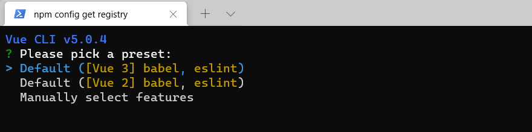
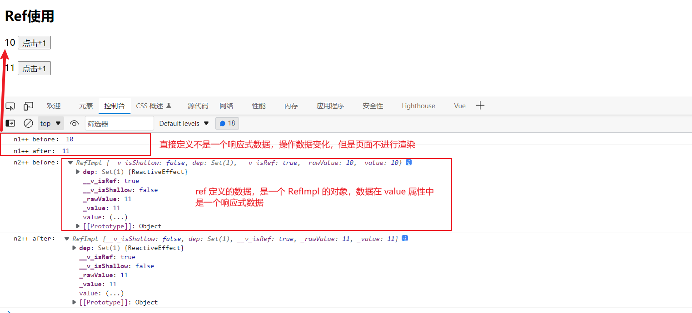

# 

# 准备

参考资料：

- Vue：https://v3.cn.vuejs.org/
- TypeScript 教程：https://www.runoob.com/typescript/ts-tutorial.html
- TypeScript 中文网：https://www.tslang.cn/index.html
- Vue Cli：https://cli.vuejs.org/zh/
- Vite：https://v3.cn.vuejs.org/guide/installation.html#vite

注意：

- Vue3 的 Vue Devtools 与 Vue2 的不兼容，需要安装新的Vue Devtools

# 创建项目

## Vue-Cli

官网文档：https://cli.vuejs.org/zh/

> 全局安装
>
> - 最新的 vue/cli  官方推荐 node 版本 V10 以上。实测 V16 以上最好

```sh
# 安装
npm install -g @vue/cli

# 查看版本
vue --version
```

> 创建

```sh
vue create <project-name>
```

> 选择一个模板
>
> -  Default ([Vue 3] babel, eslint)：Vue3 + babel + eslint
> -  Default ([Vue 2] babel, eslint)：Vue2 + babel + eslint
> -  Manually select features：自定义



> 选择需要安装的模块包。* ：代表选中


> 选择 Vue 版本


后续步骤根据实际需求进行选择。

其余配置参考官方文档：https://cli.vuejs.org/zh/config/

## Vite

具体可参考官方文档：https://cn.vitejs.dev/guide/

# Vue3 新特性

- 组件不在需要唯一根标签，可以存在多个根标签
- 组合式 API 使用前都需要导入

## 生命周期

> Vue3 新增了 `beforeUnmount` 和 `unmounted` 。其实就是对应 Vue2 的 `beforeDestroy` 和 `destroyed`


# Composition API

`Composition API（组合式 API）` Vue3 新引入的概念，Vue2 中虽然是使用 (`data`、`computed`、`methods`、`watch`) 组件选项来组织逻辑进行开发，但有一个大型组件其中会涉及很多逻辑点，不便于维护开发，使用组合式 API 可将相关代码进行收集拆分组件。

官网介绍：https://v3.cn.vuejs.org/guide/composition-api-introduction.html#%E4%BB%80%E4%B9%88%E6%98%AF%E7%BB%84%E5%90%88%E5%BC%8F-api

> 注意：
>
> - 组合式 API 使用前都需要导入

## setup

> setup：
>
> - 可以使用 Vue3 提供的组合式API 的地方，只在初始化时执行一次
> - 函数如果返回对象, 对象中的属性或方法, 模板中可以直接使用
> - 模板中使用变量或者方法都需要返回

```vue
<template>
  {{number}}
</template>

<script lang="ts">
// defineComponent 函数，定义一个组件
import { defineComponent } from 'vue';

export default defineComponent({
  name: 'App',
  setup () {
    let number = 10
    return {
      number
    }
  }
});
</script>
```

### 生命周期

> Vue3 中的生命周期钩子除了和 Vue2 选项式API 一样的写法外，还可以在 setup 中使用组合式API 定义生命周期钩子。
>
> - setup 执行是在 `beforeCreate` 之前执行，此时组件还没有创建
> - setup 中不能使用 `this` ，执行时组件没有创建 `this = undefined` 
> - 生命周期钩子前面加上 `on` 来访问组件的生命周期钩子 
> - `beforeCreate`、`created` 这两个没有对应的组合式 API 的生命周期钩子，其实可以吧 `setup ` 看作对应的钩子。
> - 组合式 API 生命周期钩子函数比选项式的执行时间靠前

| 选项式 API        | Hook inside `setup` |
| ----------------- | ------------------- |
| `beforeCreate`    | Not needed*         |
| `created`         | Not needed*         |
| `beforeMount`     | `onBeforeMount`     |
| `mounted`         | `onMounted`         |
| `beforeUpdate`    | `onBeforeUpdate`    |
| `updated`         | `onUpdated`         |
| `beforeUnmount`   | `onBeforeUnmount`   |
| `unmounted`       | `onUnmounted`       |
| `errorCaptured`   | `onErrorCaptured`   |
| `renderTracked`   | `onRenderTracked`   |
| `renderTriggered` | `onRenderTriggered` |
| `activated`       | `onActivated`       |
| `deactivated`     | `onDeactivated`     |


```vue
<template>
  <h2>setup</h2>
  {{number}} <br><br>
  <button @click="number++">修改数据</button>
</template>

<script lang="ts">
import {
  defineComponent,
  onBeforeMount,
  onBeforeUnmount,
  onBeforeUpdate,
  onMounted, onUnmounted,
  onUpdated,
  reactive,
  ref
} from 'vue';

// 生命周期钩子
export default defineComponent({
  name: 'App',
  setup () {
    // 在组件创建前执行
    console.log('setup')
    // 没有this
    console.log('this==>', this)

    let number = ref(10)

    // 生命周期钩子前面加上 `on` 来访问组件的生命周期钩子
    onBeforeMount(() => {
      console.log('onBeforeMount')
    })

    onMounted(() => {
      console.log('onMounted')
    })

    onBeforeUpdate(() => {
      console.log('onBeforeUpdate')
    })

    onUpdated(() => {
      console.log('onUpdated')
    })

    onBeforeUnmount(() => {
      console.log('onBeforeUnmount')
    })

    onUnmounted(() => {
      console.log('onUnmounted')
    })

    
    return {
      number
    }
  },
  beforeCreate() {
    console.log('beforeCreate')
  },
  created() {
    console.log('created')
  },
  beforeMount() {
    console.log('beforeMount')
  },
  mounted() {
    console.log('mounted')
  },
  beforeUpdate() {
    console.log('beforeUpdate')
  },
  updated() {
    console.log('updated')
  },
  beforeUnmount() {
    console.log('beforeUnmount')
  },
  unmounted() {
    console.log('unmounted')
  }
});
</script>
```

## ref

> `ref`：定义一个响应式数据（基本类型 / 对象）
>
> - 语法：` const xxx = ref(initValue)`
> - js 中操作数据：`xxx.value`
> - 模板中操作数据：不需要 `.value`
> - 一般用来定义一个基本类型的响应式数据



```vue
<template>
  <h2>Ref使用</h2>
  {{n1}}  <button @click="addN1">点击+1</button> <br><br>
  {{n2}}  <button @click="addN2">点击+1</button> <br><br>
</template>

<script lang="ts">
// defineComponent 函数，定义一个组件
import {defineComponent, ref} from 'vue';

export default defineComponent({
  name: 'App',
  setup () {
    // 非响应式数据
    let n1 = 10
    // 数据变化但是页面不进行渲染
    function addN1() {
      console.log('n1++ before：', n1)
      n1++
      console.log('n1++ after：', n1)
    }

    // ref 定义一个响应式数据，返回 Ref 对象，对象中有 value 属性
    //    - 一般是定义基本类型数据
    //    - 操作数据需要调用对象的 value 属性
    //    - 模板中使用数据不需要 .value
    let n2 = ref(10)
    function addN2() {
      console.log('n2++ before：', n2)
      // n2++   Ref 返回的是对象，不能对对象进行++
      n2.value++
      console.log('n2++ after：', n2)
    }
    
    return {
      n1,
      addN1,
      n2,
      addN2
    }
  }
});
</script>
```

##  reactive

> reactive：
>
> - 定义一个响应式对象属性，返回一个 Proxy 代理对象
> - 不能定义基本数据类型
> - 响应式转换是“深层的”：会影响对象内部所有嵌套的属性


```vue
<template>
  <h2>reactive使用</h2>
  姓名：{{user.name}} <br><br>
  年龄：{{user.age}} <br><br>
  性别：{{user.gender}} <br><br>
  爱好：{{user.hobby}} <br><br>
  老婆：{{user.wife}} <br><br>
  <button @click="updateUser">修改数据</button>
</template>

<script lang="ts">
import {defineComponent, reactive} from 'vue';

export default defineComponent({
  name: 'App',
  setup () {

    // reactive 一般用于定义响应式对象
    // 返回一个 Proxy 的代理对象，被代理的对象就是传入的对象。响应式是深层的，会影响内部所有嵌套属性
    let user = reactive<any>({
      name: '张三',
      age: 22,
      hobby: ['抽烟', '喝酒', '烫头'],
      wife: {
        name: '小红',
        age: 20,
        hobby: ['口红', '包包']
      }
    })

    // 不能定义基本数据类型
    // let number = reactive(10)

    let updateUser = () => {
      console.log('=========updateDate===========')
      // 修改已定义属性
      user.name += '!'
      user.age += 1
      user.wife.name += '!'

      // 添加一个未定义属性
      user.gender = '男'

      // 删除一个已定义属性
      delete user.wife.hobby

      console.log(user)
    }
    
    return {
      user,
      updateUser
    }
  }
});
</script>
```

## Vue2 与 Vue3 的响应式

### Vue2

> - 对象：通过 defineProperty 对象的已有属性值的读取和修改进行劫持（ 监视 / 拦截 ）
> - 数组：通过重写数组更新数组一系列更新元素的方法来实现元素修改的劫持
> - 对象添加未定义属性或删除已有属性不是响应式，得通过 `Vue.set()` 操作
> - 直接通过下标替换元素或更新length，界面不会自动更新

```js
Object.defineProperty(data, 'count', {
    get () {}, 
    set () {}
})
```

### Vue3 

> - 通过Proxy(代理): 拦截对data任意属性的任意(13种)操作, 包括属性值的读写, 属性的添加, 属性的删除等...
> - 通过 Reflect(反射): 动态对被代理对象的相应属性进行特定的操作
> - 文档:
>   - https://developer.mozilla.org/zh-CN/docs/Web/JavaScript/Reference/Global_Objects/Proxy
>   - https://developer.mozilla.org/zh-CN/docs/Web/JavaScript/Reference/Global_Objects/Reflect

```js
new Proxy(data, {
	// 拦截读取属性值
    get (target, prop) {
    	return Reflect.get(target, prop)
    },
    // 拦截设置属性值或添加新属性
    set (target, prop, value) {
    	return Reflect.set(target, prop, value)
    },
    // 拦截删除属性
    deleteProperty (target, prop) {
    	return Reflect.deleteProperty(target, prop)
    }
})
```