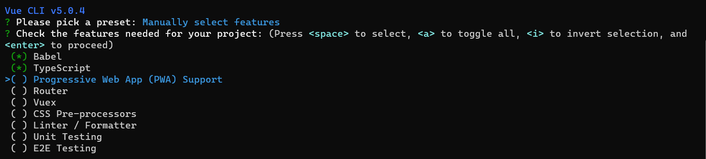
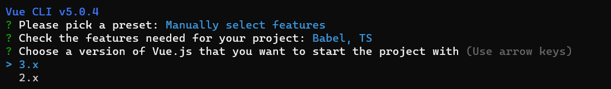

# 

# 准备

参考资料：

- Vue：https://v3.cn.vuejs.org/
- TypeScript 教程：https://www.runoob.com/typescript/ts-tutorial.html
- TypeScript 中文网：https://www.tslang.cn/index.html
- Vue Cli：https://cli.vuejs.org/zh/
- Vite：https://v3.cn.vuejs.org/guide/installation.html#vite

注意：

- Vue3 的 Vue Devtools 与 Vue2 的不兼容，需要安装新的Vue Devtools

# 创建项目

## Vue-Cli

官网文档：https://cli.vuejs.org/zh/

> 全局安装
>
> - 最新的 vue/cli  官方推荐 node 版本 V10 以上。实测 V16 以上最好

```sh
# 安装
npm install -g @vue/cli

# 查看版本
vue --version
```

> 创建

```sh
vue create <project-name>
```

> 选择一个模板
>
> -  Default ([Vue 3] babel, eslint)：Vue3 + babel + eslint
> -  Default ([Vue 2] babel, eslint)：Vue2 + babel + eslint
> -  Manually select features：自定义


> 选择需要安装的模块包。* ：代表选中



> 选择 Vue 版本



后续步骤根据实际需求进行选择。

其余配置参考官方文档：https://cli.vuejs.org/zh/config/

## Vite

具体可参考官方文档：https://cn.vitejs.dev/guide/

> Vite 需要 [Node.js](https://nodejs.org/en/) 版本 >= 12.0.0。

```sh
npm create vite@latest
# or
yarn create vite
```

根据提示输入项目名，选择模板等操作。


`vite.config.ts`

```typescript
import { defineConfig } from "vite";
import vue from "@vitejs/plugin-vue";
// @ts-ignore
import path from "path";

export default defineConfig({
  plugins: [vue()],
  base: "./", // 类似publicPath，'./'避免打包访问后空白页面，要加上，不然线上也访问不了
  resolve: {
    alias: {
      // 如果报错__dirname找不到，需要安装node,执行 npm install @types/node --save-dev 或 yarn add @types/node --save-dev
      "@": path.resolve(__dirname, "src"),
      "@assets": path.resolve(__dirname, "src/assets"),
      "@components": path.resolve(__dirname, "src/components"),
      "@images": path.resolve(__dirname, "src/assets/images"),
      "@views": path.resolve(__dirname, "src/views"),
      "@store": path.resolve(__dirname, "src/store"),
    },
  },
  build: {
    outDir: "dist",
    assetsDir: "assets", //指定静态资源存放路径
    sourcemap: false, //是否构建source map 文件
    terserOptions: {
      // 生产环境移除console
      compress: {
        drop_console: true,
        drop_debugger: true,
      },
    },
  },
  server: {
    https: false, // 是否开启 https
    open: false, // 是否自动在浏览器打开
    port: 3000, // 端口号
    host: "0.0.0.0",
    proxy: {
      "/api": {
        target: "", // 后台接口
        changeOrigin: true,
        secure: false, // 如果是https接口，需要配置这个参数
        // ws: true, //websocket支持
        rewrite: (path) => path.replace(/^\/api/, ""),
      },
    },
  },
  // 引入第三方的配置
  optimizeDeps: {
    include: [],
  },
});
```

# Vue3 新特性

- 组件不在需要唯一根标签，可以存在多个根标签
- 组合式 API 使用前都需要导入

## 生命周期

> Vue3 新增了 `beforeUnmount` 和 `unmounted` 。其实就是对应 Vue2 的 `beforeDestroy` 和 `destroyed`


# Composition API

`Composition API（组合式 API）` Vue3 新引入的概念，Vue2 中虽然是使用 (`data`、`computed`、`methods`、`watch`) 组件选项来组织逻辑进行开发，但有一个大型组件其中会涉及很多逻辑点，不便于维护开发，使用组合式 API 可将相关代码进行收集拆分组件。

官网介绍：https://v3.cn.vuejs.org/guide/composition-api-introduction.html#%E4%BB%80%E4%B9%88%E6%98%AF%E7%BB%84%E5%90%88%E5%BC%8F-api

> 注意：
>
> - 组合式 API 使用前都需要导入

## setup

> setup：
>
> - 可以使用 Vue3 提供的组合式API 的地方，只在初始化时执行一次
> - 函数如果返回对象, 对象中的属性或方法, 模板中可以直接使用
> - 模板中使用变量或者方法都需要返回

```vue
<template>
  {{number}}
</template>

<script lang="ts">
// defineComponent 函数，定义一个组件
import { defineComponent } from 'vue';

export default defineComponent({
  name: 'App',
  setup () {
    let number = 10
    return {
      number
    }
  }
});
</script>
```

### 生命周期

> Vue3 中的生命周期钩子除了和 Vue2 选项式API 一样的写法外，还可以在 setup 中使用组合式API 定义生命周期钩子。
>
> - setup 执行是在 `beforeCreate` 之前执行，此时组件还没有创建
> - setup 中不能使用 `this` ，执行时组件没有创建 `this = undefined` 
> - 生命周期钩子前面加上 `on` 来访问组件的生命周期钩子 
> - `beforeCreate`、`created` 这两个没有对应的组合式 API 的生命周期钩子，其实可以吧 `setup ` 看作对应的钩子。
> - 组合式 API 生命周期钩子函数比选项式的执行时间靠前

| 选项式 API        | Hook inside `setup` |
| ----------------- | ------------------- |
| `beforeCreate`    | Not needed*         |
| `created`         | Not needed*         |
| `beforeMount`     | `onBeforeMount`     |
| `mounted`         | `onMounted`         |
| `beforeUpdate`    | `onBeforeUpdate`    |
| `updated`         | `onUpdated`         |
| `beforeUnmount`   | `onBeforeUnmount`   |
| `unmounted`       | `onUnmounted`       |
| `errorCaptured`   | `onErrorCaptured`   |
| `renderTracked`   | `onRenderTracked`   |
| `renderTriggered` | `onRenderTriggered` |
| `activated`       | `onActivated`       |
| `deactivated`     | `onDeactivated`     |


```vue
<template>
  <h2>setup</h2>
  {{number}} <br><br>
  <button @click="number++">修改数据</button>
</template>

<script lang="ts">
import {
  defineComponent,
  onBeforeMount,
  onBeforeUnmount,
  onBeforeUpdate,
  onMounted, onUnmounted,
  onUpdated,
  reactive,
  ref
} from 'vue';

// 生命周期钩子
export default defineComponent({
  name: 'App',
  setup () {
    // 在组件创建前执行
    console.log('setup')
    // 没有this
    console.log('this==>', this)

    let number = ref(10)

    // 生命周期钩子前面加上 `on` 来访问组件的生命周期钩子
    onBeforeMount(() => {
      console.log('onBeforeMount')
    })

    onMounted(() => {
      console.log('onMounted')
    })

    onBeforeUpdate(() => {
      console.log('onBeforeUpdate')
    })

    onUpdated(() => {
      console.log('onUpdated')
    })

    onBeforeUnmount(() => {
      console.log('onBeforeUnmount')
    })

    onUnmounted(() => {
      console.log('onUnmounted')
    })

    
    return {
      number
    }
  },
  beforeCreate() {
    console.log('beforeCreate')
  },
  created() {
    console.log('created')
  },
  beforeMount() {
    console.log('beforeMount')
  },
  mounted() {
    console.log('mounted')
  },
  beforeUpdate() {
    console.log('beforeUpdate')
  },
  updated() {
    console.log('updated')
  },
  beforeUnmount() {
    console.log('beforeUnmount')
  },
  unmounted() {
    console.log('unmounted')
  }
});
</script>
```

### 返回值

> - 一般返回一个对象，其中包含属性和方法，供模板使用
> - setup 中返回的属性和方法会和 Vue2 中选项式 API 中的属性和方法合并，同名的话  setup 中的优先级高
> - 选项式 API 中可以访问 setup 返回的属性和方法。setup 中不能访问选项式 API 中的属性和方法
> - setup不能是一个async函数：因为返回值不再是return的对象，而是promise，模板看不到return对象中的属性数据

```vue
<template>
  <h2>setup</h2>
  number：{{number}} <br><br>
  name：{{name}} <br><br>
  age：{{age}} <br><br>
  <button @click="update">修改数据</button>
  <button @click="update1">修改数据1</button>
</template>

<script lang="ts">
import {
  defineComponent,
  onBeforeMount,
  onBeforeUnmount,
  onBeforeUpdate,
  onMounted, onUnmounted,
  onUpdated,
  reactive,
  ref
} from 'vue';

export default defineComponent({
  name: 'App',
  data () {
    return {
      number: 5,
      name: '张三'
    }
  },
  setup () {

    let number = ref(3)

    let age = ref(10)

    let update = () => {
      number.value++

      // setup 中不能访问 选项式 API 的属性或方法
      // name += '!'
    }

    return {
      number,
      age,
      update
    }
  },
  methods: {
    update1 () {
      // 选项式 API 可以访问 setup 返回的属性和方法
      this.number++
      this.name += "!"
      this.age++
      this.update()
    }
  }
});
</script>
```

### 参数

> - `props`：接收父组件传递子组件的值，并且是使用 props 接收的参数。是响应式的数据，不能用 ES6 解构
> - `context`：普通 JavaScript 对象，暴露了其它可能在 `setup` 中有用的值，不是响应式的可以使用 ES6 解构
>   - `attrs`：接收父组件传递子组件的值，并且没有在 props 接收的参数。相当于 `this.$attrs`
>   - `emit`：用来分发自定义事件的函数。相当于 `this.$emit`
>   - `expose`：该函数允许通过公共组件实例暴露特定的 property。
>   - `slots`：包含所有传入的插槽内容的对象。 相当于 `this.$slots`

`App.vue`

```vue
<template>
  <h2>父组件</h2>
  number：{{number}}<br><br>
  <button @click="number++">更新数据</button>
  <hr>
  <Child :number="number" test="test" @emitUpdate="emitUpdate"></Child>
</template>

<script lang="ts">
import {
  defineComponent,
  ref
} from 'vue';
import Child from "@/components/Child.vue";

export default defineComponent({
  name: 'App',
  components: {
    Child
  },
  setup () {

    let number = ref(10)

    let emitUpdate = (val:number) => {
      console.log(val)
      number.value += val
    }

    return {
      number,
      emitUpdate
    }
  }
});
</script>
```

`Child.vue`

```
<template>
  <h2>子组件</h2>
  number：{{number}}<br><br>
  <button @click="updateNumber">更新数据</button>
</template>

<script>
export default {
  name: "Child",
  props: ['number'],
  // setup (props, context) {
  //   console.log("context：", context)
  setup (props, {attrs, emit, expose, slots}) {
    console.log('Child ----- setup ----- init')
    console.log("poops：", props)
    console.log("attrs：", attrs);
    console.log("emit：", emit);
    console.log("expose：", expose);
    console.log("slots：", slots);

    let updateNumber = () => {
      emit('emitUpdate', 10)
    }

    return {
      updateNumber
    }
  }
}
</script>
```

### script setup

参考官方文档：https://v3.cn.vuejs.org/api/sfc-script-setup.html#%E5%9F%BA%E6%9C%AC%E8%AF%AD%E6%B3%95

`<script setup>`： 是在单文件组件 (SFC) 中使用组合式 API 的编译时语法糖。相比于普通的 `<script>` 语法，它具有更多优势：

- 更少的样板内容，更简洁的代码。
- 能够使用纯 Typescript 声明 props 和抛出事件。
- 更好的运行时性能 (其模板会被编译成与其同一作用域的渲染函数，没有任何的中间代理)。
- 更好的 IDE 类型推断性能 (减少语言服务器从代码中抽离类型的工作)。

> 就是 `setup () {}` 的语法糖，简单写法，具体可参考官网。

```vue
<template>
  number：{{ number }} <br><br>
  <button @click="number++">number++</button>
</template>

<script setup lang="ts">
  import {ref} from "vue";

  const number = ref(10)
</script>
```

## refs

`ref`：接收一个值返回响应式可变 Ref 对象。ref 对象仅有一个 `.value` property，指向该内部值。

- 一般用来定义一个基本类型的响应式数据

> 直接定义属性不是响应式数据，操作数据改变，页面不同步渲染


```vue
<template>
  number：{{ number }} <br><br>
  <button @click="numberAdd">更新数据</button>
</template>

<script setup lang="ts">
 
  let number:number = 10

  const numberAdd = () => {
    number++
    console.log(number);
  }

</script>
```

> 定义响应式数据
>
> - js 中操作数据：`xxx.value`
> - 模板中操作数据：不需要 `.value`


```vue
<template>
  number：{{ number }} <br><br>
  <button @click="numberAdd">更新数据</button>
</template>

<script setup lang="ts">
  import { Ref, ref } from 'vue'

  let number = ref<number>(10)

  // let number:Ref<number> = ref(10)

  const numberAdd = () => {
    number.value++
    console.log(number)
  }

</script>
```

### isRef

> 判断是不是一个 ref 对象


```vue
<script setup lang="ts">
  import { isRef, Ref, ref } from 'vue'

  let number = ref<number>(10)
  
  let msg = 'hello'

  console.log('number：', isRef(number))
  console.log('msg：', isRef(msg))
  
</script>
```

### shallowRef

> 创建一个跟踪自身 `.value` 变化的 ref，但不会使其值也变成响应式的。

```vue
<template>
  user{{ user }} <br><br>
  <button @click="update">更新数据</button>
</template>

<script setup lang="ts">
  import { shallowRef } from 'vue'

  let user = shallowRef({
    name: '张三'
  })

  const update = () => {
    // 其 .value 是响应式 但内部的值不是响应式
    // user.value.name = '李四'     // 不是响应式修改
    user.value = {                  // 响应式
        name: '李四'
    }
    console.log(user)
  }

</script>
```

### triggerRef

> 强制更新页面DOM。可以与 shallowRef 配合使用

```vue
<template>
  user{{ user }} <br><br>
  <button @click="update">更新数据</button>
</template>

<script setup lang="ts">
  import { shallowRef, triggerRef  } from 'vue'

  let user = shallowRef({
    name: '张三'
  })

  
  const update = () => {
    
    // 非响应式
    user.value.name = '李四'

    console.log(user)

    // 强制更新 DOM
    triggerRef(user)
  }

</script>
```

### customRef

> - `customRef` 用于自定义返回一个 ref 对象，可以显式地控制依赖追踪和触发响应，接受工厂函数
> - 两个参数分别是用于追踪的 `track` 与用于触发响应的 `trigger`，并返回一个带有 `get` 和 `set` 属性的对象
> - 通过 `customRef` 返回的 ref 对象，和正常 ref 对象一样，通过 `.value` 修改或读取值

```vue
<template>
  message：<input type="text" v-model="message"><br><br>
  {{message}}
</template>

<script setup lang="ts">
  import { customRef } from 'vue'

  // 自定义防抖 Ref
  function MyRef<T>(value:string, delay = 500) {
    let timeout:any
    return customRef((track, trigger) => {
      return {
        get() {
          track()  // 追踪当前数据
          return value 
        },
        set(newValue:string) {
          clearTimeout(timeout)
          timeout = setTimeout(() => {
            value = newValue
            trigger()  // 触发响应,即更新界面
          }, delay)
        }
      }
    })
  }

  let message = MyRef<string>('')

</script>
```

## reactive

> reactive：
>
> - 定义一个响应式对象属性，返回一个 Proxy 代理对象
> - 不能定义基本数据类型
> - 响应式转换是“深层的”：会影响对象内部所有嵌套的属性


```vue
<template>
  Object：{{user}}<br><br>
  Array：{{nameList}}<br><br>
  <button @click="update">更新数据</button>
</template>

<script setup lang="ts">
  import { reactive } from 'vue'

  // reactive 不能定义基本数据类似
  // let number = reactive(10)

  let user = reactive({
    name: 'zhngsan',
    age: 20
  })

  let nameList = reactive(['张三', '李四'])

  const update = () => {
    // 直接赋值会破坏响应式
    // user = {
    //   name: '李四',
    //   age: 22
    // }

    // nameList = ['王五']

    // reactive 属性操作不需要 .value
    user.name = '李四'
    user.age = 22
    nameList.push('王五')

    console.log('user：', user)
    console.log('nameList', nameList)
  }

</script>
```

### readonly

> 接受一个对象 (响应式或纯对象) 或 [ref](https://v3.cn.vuejs.org/api/refs-api.html#ref) 并返回原始对象的只读代理。只读代理是深层的：任何被访问的嵌套 property 也是只读的。


```vue
<template>
  Object：{{user}}<br><br>
  <button @click="update">更新数据</button>
</template>

<script setup lang="ts">
  import { reactive, readonly } from 'vue'

  let user = reactive({
    name: 'zhngsan',
    age: 20
  })

  // 拷贝一份proxy对象将其设置为只读
  let copyUser = readonly(user)

  const update = () => {
    user.age = 22

    // 只读属性不能被修改
    copyUser.age =30
  }

</script>
```

### isProxy

> 检查对象是否是由 [`reactive`](https://v3.cn.vuejs.org/api/basic-reactivity.html#reactive) 或 [`readonly`](https://v3.cn.vuejs.org/api/basic-reactivity.html#readonly) 创建的 proxy。

### isReactive

> 检查对象是否是由 [`reactive`](https://v3.cn.vuejs.org/api/basic-reactivity.html#reactive) 创建的响应式代理。

### isReadonly

> 检查对象是否是由 [`readonly`](https://v3.cn.vuejs.org/api/basic-reactivity.html#readonly) 创建的只读代理。

### shallowReactive

> 创建一个响应式代理，它跟踪其自身 property 的响应性，但不执行嵌套对象的深层响应式转换 (暴露原始值)。
>
> 一个只能对浅层的数据修改 如果是深层的数据只会改变值 不会改变视图
>
> 注意：
>
> - 页面 `DOM` 挂载之前的修改是有效的
> - 同时修改自身和深层数据也是有效的，修改自身属性完毕之后重新渲染 DOM 也会将深层数据渲染

```vue
<template>
  Object：{{user}}<br><br>
  <button @click="update1">一块修改</button>
  <button @click="update2">修改自身</button>
  <button @click="update3">修改嵌套对象</button>
</template>

<script setup lang="ts">
  import { shallowReactive } from 'vue'

  // 定义一个只能对浅层的数据修改 如果是深层的数据只会改变值 不会改变视图
  let user = shallowReactive({
    name: '张三',
    age: 20,
    wife: {
      name: '小红',
      age: 20
    }
  })

  // 注意：页面DOM挂载之前的修改是有效的
  user.age++
  user.wife.age++

  // 同时修改也是有效的，修改自身属性完毕之后重新渲染 DOM 也会将深层数据渲染
  const update1 = () => {
    user.age++
    user.wife.age++
  }

  // 自身属性是响应式的，是有效的
  const update2 = () => {
    user.age++
  }

  // 深层数据非响应式 修改只是数据变化，但页面不渲染
  const update3 = () => {
    user.wife.age++
  }

</script>
```


## Vue2 与 Vue3 的响应式

### Vue2

> - 对象：通过 defineProperty 对象的已有属性值的读取和修改进行劫持（ 监视 / 拦截 ）
> - 数组：通过重写数组更新数组一系列更新元素的方法来实现元素修改的劫持
> - 对象添加未定义属性或删除已有属性不是响应式，得通过 `Vue.set()` 操作
> - 直接通过下标替换元素或更新length，界面不会自动更新

```js
Object.defineProperty(data, 'count', {
    get () {}, 
    set () {}
})
```

### Vue3 

> - 通过Proxy(代理): 拦截对data任意属性的任意(13种)操作, 包括属性值的读写, 属性的添加, 属性的删除等...
> - 通过 Reflect(反射): 动态对被代理对象的相应属性进行特定的操作
> - 文档:
>   - https://developer.mozilla.org/zh-CN/docs/Web/JavaScript/Reference/Global_Objects/Proxy
>   - https://developer.mozilla.org/zh-CN/docs/Web/JavaScript/Reference/Global_Objects/Reflect

```js
new Proxy(data, {
	// 拦截读取属性值
    get (target, prop) {
    	return Reflect.get(target, prop)
    },
    // 拦截设置属性值或添加新属性
    set (target, prop, value) {
    	return Reflect.set(target, prop, value)
    },
    // 拦截删除属性
    deleteProperty (target, prop) {
    	return Reflect.deleteProperty(target, prop)
    }
})
```