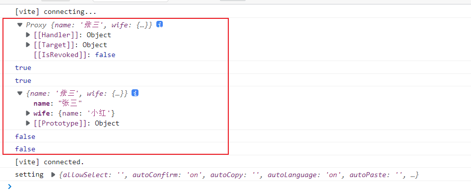

# 

# 准备

参考资料：

- Vue：https://v3.cn.vuejs.org/
- TypeScript 教程：https://www.runoob.com/typescript/ts-tutorial.html
- TypeScript 中文网：https://www.tslang.cn/index.html
- Vue Cli：https://cli.vuejs.org/zh/
- Vite：https://v3.cn.vuejs.org/guide/installation.html#vite

注意：

- Vue3 的 Vue Devtools 与 Vue2 的不兼容，需要安装新的Vue Devtools

# 创建项目

## Vue-Cli

官网文档：https://cli.vuejs.org/zh/

> 全局安装
>
> - 最新的 vue/cli  官方推荐 node 版本 V10 以上。实测 V16 以上最好

```sh
# 安装
npm install -g @vue/cli

# 查看版本
vue --version
```

> 创建

```sh
vue create <project-name>
```

> 选择一个模板
>
> -  Default ([Vue 3] babel, eslint)：Vue3 + babel + eslint
> -  Default ([Vue 2] babel, eslint)：Vue2 + babel + eslint
> -  Manually select features：自定义


> 选择需要安装的模块包。* ：代表选中


> 选择 Vue 版本


后续步骤根据实际需求进行选择。

其余配置参考官方文档：https://cli.vuejs.org/zh/config/

## Vite

具体可参考官方文档：https://cn.vitejs.dev/guide/

> Vite 需要 [Node.js](https://nodejs.org/en/) 版本 >= 12.0.0。

```sh
npm create vite@latest
# or
yarn create vite
```

根据提示输入项目名，选择模板等操作。


`vite.config.ts`

```typescript
import { defineConfig } from "vite";
import vue from "@vitejs/plugin-vue";
// @ts-ignore
import path from "path";

export default defineConfig({
  plugins: [vue()],
  base: "./", // 类似publicPath，'./'避免打包访问后空白页面，要加上，不然线上也访问不了
  resolve: {
    alias: {
      // 如果报错__dirname找不到，需要安装node,执行 npm install @types/node --save-dev 或 yarn add @types/node --save-dev
      "@": path.resolve(__dirname, "src"),
      "@assets": path.resolve(__dirname, "src/assets"),
      "@components": path.resolve(__dirname, "src/components"),
      "@images": path.resolve(__dirname, "src/assets/images"),
      "@views": path.resolve(__dirname, "src/views"),
      "@store": path.resolve(__dirname, "src/store"),
    },
  },
  build: {
    outDir: "dist",
    assetsDir: "assets", //指定静态资源存放路径
    sourcemap: false, //是否构建source map 文件
    terserOptions: {
      // 生产环境移除console
      compress: {
        drop_console: true,
        drop_debugger: true,
      },
    },
  },
  server: {
    https: false, // 是否开启 https
    open: false, // 是否自动在浏览器打开
    port: 3000, // 端口号
    host: "0.0.0.0",
    proxy: {
      "/api": {
        target: "", // 后台接口
        changeOrigin: true,
        secure: false, // 如果是https接口，需要配置这个参数
        // ws: true, //websocket支持
        rewrite: (path) => path.replace(/^\/api/, ""),
      },
    },
  },
  // 引入第三方的配置
  optimizeDeps: {
    include: [],
  },
});
```

# Vue3 新特性

- 组件不在需要唯一根标签，可以存在多个根标签
- 组合式 API 使用前都需要导入

## 生命周期

> Vue3 新增了 `beforeUnmount` 和 `unmounted` 。其实就是对应 Vue2 的 `beforeDestroy` 和 `destroyed`


## v-model

> `v-model` 其实是一个语法糖。通过 `props` 和 `emit` 组合而成的。
>
> 新特性：
>
> - prop：`value` -> `modelValue`；
> - 事件：`input` -> `update:modelValue`；
> - `v-bind` 的 `.sync` 修饰符和组件的 `model` 选项已移除
> - 新增 支持多个 `v-model`
> - 新增 支持自定义 修饰符。通过 `modelModifiers` prop 提供给组件

`App.vue`

```vue
<template>
  <h1>App.vue</h1>
  showChild：{{showChild}}<br><br>
  title：{{title}}<br><br>
  <button @click="showChild = !showChild">切换Chile</button>
  <!-- 多个 v-model 可使用：指定 -->
  <Child v-model.test="showChild" v-model:title.test="title"></Child>
</template>

<script setup lang="ts">
  import Child from './Child.vue'
  import {ref} from 'vue'

  let showChild = ref(true)
  let title = ref('提示标题111')
</script>
```

`Child.vue`

```vue
<template>
  <div v-if="modelValue">
    <h1 >Child.vue</h1>
    title：{{ title }} <br><br>
    <button @click="close">关闭</button> <br><br>
    <button @click="updateTitle">修改标题</button>
  </div>
</template>

<script setup lang="ts">

  // prop 默认值为 modelValue
  type Props = {
    modelValue: boolean,
    modelModifiers: {
      default: () => {}
    },
    title: string,
    // 自定义修饰符
    titleModifiers: {
      prefix: boolean
    }
  }
  const propsData = defineProps<Props>()

  // 双向绑定默认事件为 update:modelValue  自定义的为 update：xxx
  const emit = defineEmits(['update:modelValue', 'update:title'])

  let close = () => {
    console.log(propsData.modelModifiers)
    emit('update:modelValue', false)
  }

  let updateTitle = () => {
    // 查看有指定名称的属性是否有指定的修饰符。后续可根据实际业务做操作
    console.log(propsData.titleModifiers)
    console.log(propsData.titleModifiers?.prefix)
    emit('update:title', '修改后的标题')
  }
</script>
```

## directives

> `directives` 自定义指令。
>
> 官网资料：
>
> - https://v3.cn.vuejs.org/guide/custom-directive.html#%E7%AE%80%E4%BB%8B
> - https://v3.cn.vuejs.org/api/application-api.html#directive
>
> 指令钩子函数：
>
> - `created`：在绑定元素的 attribute 或事件监听器被应用之前调用
> - `beforeMount`：当指令第一次绑定到元素并且在挂载父组件之前调用
> - `mounted`：在绑定元素的父组件被挂载前调用
> - `beforeUpdate`：在更新包含组件的 VNode 之前调用
> - `updated`：在包含组件的 VNode 及其子组件的 VNode 更新后调用
> - `beforeUnmount`：在卸载绑定元素的父组件之前调用
> - `unmounted`：当指令与元素解除绑定且父组件已卸载时，只调用一次
>
> 钩子参数详解：
>
> - `el`：当前绑定的 DOM 元素
> - `binding`：
>   - `instance`：使用指令的组件实例。
>   - `value`：传递给指令的值。例如，在 `v-focus="{background: 'red'}"` 中，该值为 `{background: 'red'}`。
>   - `oldValue`：先前的值，仅在 `beforeUpdate` 和 `updated` 中可用。无论值是否有更改都可用。
>   - `arg`：传递给指令的参数(如果有的话)。例如在 `v-focus:beloved` 中，arg 为 `"beloved"`。
>   - `modifiers`：包含修饰符(如果有的话) 的对象。例如在 `v-focus.input` 中，修饰符对象为 `{input: true}`。
>   - `dir`：一个对象，在注册指令时作为参数传递。钩子函数
> - `vnode`：当前元素的虚拟DOM
> - `prevVnode`：上一个虚拟节点，仅在 `beforeUpdate` 和 `updated` 钩子中可用
>
> 函数简写：
>
> - `mounted` 和 `updated` 时触发相同行为。
> - 不关心其他的钩子函数。
>
> 注意：
>
> - 自定义指令必须是 `v 开头驼峰命名`

```vue
<template>
  <h1>App.vue</h1>
  <div v-if="showInput">
    name：<input type="text" v-model="name" v-focus:beloved.input="{background: 'red'}" v-test="{width: '1000px',height: '100px'}"> <br><br>
  </div>
  <button @click="showInput = !showInput">切换显示</button>
</template>

<script setup lang="ts">
  import {Directive, DirectiveBinding, ref, RendererNode, VNode} from 'vue'

  // 自定义指令必须是 v开头驼峰命名
  const vFocus:Directive = {
    created() {
      console.log('在绑定元素的 attribute 或事件监听器被应用之前调用')
    },
    beforeMount() {
      console.log('当指令第一次绑定到元素并且在挂载父组件之前调用')
    },
    // el：当前绑定的DOM 元素
    // binding：指令相关数据
    // vnode：当前元素的虚拟DOM
    // prevVnode：上一个虚拟节点，仅在 beforeUpdate 和 updated 钩子中可用
    mounted(el:HTMLElement, binding:DirectiveBinding, vnode:RendererNode, prevVnode:any) {
    // mounted(...par) {
      console.log('在绑定元素的父组件被挂载前调用')
      // console.log(par)
      console.log(el)
      console.log(binding)
      console.log(vnode)
      console.log(prevVnode)

      el.style.background = binding.value.background
      if (binding.modifiers.input) {
        el.focus()
      }
    },
    beforeUpdate() {
      console.log('在更新包含组件的 VNode 之前调用')
    },
    updated(el:HTMLElement, binding:DirectiveBinding, vnode:RendererNode, prevVnode:VNode) {
      console.log('在包含组件的 VNode 及其子组件的 VNode 更新后调用')
      console.log(el)
      console.log(binding)
      console.log(vnode)
      console.log(prevVnode)
    },
    beforeUnmount() {
      console.log('在卸载绑定元素的父组件之前调用')
    },
    unmounted() {
      console.log('当指令与元素解除绑定且父组件已卸载时，只调用一次')
    }
  }

  // 函数简写
  // mounted 和 updated 时触发相同行为，不关心其他的钩子函数。
  const vTest:Directive = (el, binding: DirectiveBinding) => {
    el.style.width = binding.value.width
    el.style.height = binding.value.height
  }

  let name = ref()
  let showInput = ref(true)
</script>

```

## hooks

> 自定义Hook。主要用来处理复用代码逻辑的一些封装。相当于 vue2 中的 `Mixins`。
>
> Vue2 中 mixins 的缺点：
>
> - 涉及到覆盖的问题，组件的 data、methods、filters 会覆盖 mixins 里的同名 data、methods、filters。
> - 变量来源不明确（隐式传入），不利于阅读，使代码变得难以维护。
>
> Vue3 自定义 hook ：
>
> - Vue3 的 hook 函数，相当于 vue2 的 mixin, 不同在与 hooks 是函数
> - Vue3 的 hook 函数，可以帮助提高代码的复用性，能在不同的组件中都利用 hooks 函数
>
> hook 库：https://vueuse.org/

自定义 hooks 

```typescript
import {onMounted} from 'vue'

type Options = {
    el: string
}

export default function (options:Options):Promise<string> {
    return new Promise((resolve) => {
        onMounted(() => {
            let img:HTMLImageElement = document.querySelector(options.el) as HTMLImageElement
            console.log('========================')
            console.log(img)
            // 图片加载完毕调用转换 base64
            img.onload = () => {
                resolve(base64(img))
            }
        })

        const base64 = (el:HTMLImageElement) => {
            const canvas = document.createElement('canvas')
            canvas.width = el.width
            canvas.height = el.height
            const ctx = canvas.getContext('2d')
            ctx?.drawImage(el, 0, 0, canvas.width, canvas.height)
            return canvas.toDataURL('image/png');
        }
    })
}
```

使用

```vue
<template>
  <h1>App.vue</h1>
  <div style="height: 300px;display: flex;align-content: center">
    
    <textarea style="width: 100%" readonly v-model="base64"></textarea>
  </div>
  <br><br>
</template>

<script setup lang="ts">
import {ref} from 'vue'
// 引入自定义 hook，命名规则一般是 use 开头
import useBase64 from './hooks'


let base64 = ref()

// 调用自定义 hook 函数
useBase64({
  el: '#img'
}).then(res => {
  base64.value = res
})

</script>
```

# Composition API

`Composition API（组合式 API）` Vue3 新引入的概念，Vue2 中虽然是使用 (`data`、`computed`、`methods`、`watch`) 组件选项来组织逻辑进行开发，但有一个大型组件其中会涉及很多逻辑点，不便于维护开发，使用组合式 API 可将相关代码进行收集拆分组件。

官网介绍：https://v3.cn.vuejs.org/guide/composition-api-introduction.html#%E4%BB%80%E4%B9%88%E6%98%AF%E7%BB%84%E5%90%88%E5%BC%8F-api

> 注意：
>
> - 组合式 API 使用前都需要导入

## setup

> setup：
>
> - 可以使用 Vue3 提供的组合式API 的地方，只在初始化时执行一次
> - 函数如果返回对象, 对象中的属性或方法, 模板中可以直接使用
> - 模板中使用变量或者方法都需要返回

```vue
<template>
  {{number}}
</template>

<script lang="ts">
// defineComponent 函数，定义一个组件
import { defineComponent } from 'vue';

export default defineComponent({
  name: 'App',
  setup () {
    let number = 10
    return {
      number
    }
  }
});
</script>
```

### 生命周期

> Vue3 中的生命周期钩子除了和 Vue2 选项式API 一样的写法外，还可以在 setup 中使用组合式API 定义生命周期钩子。
>
> - setup 执行是在 `beforeCreate` 之前执行，此时组件还没有创建
> - setup 中不能使用 `this` ，执行时组件没有创建 `this = undefined` 
> - 生命周期钩子前面加上 `on` 来访问组件的生命周期钩子 
> - `beforeCreate`、`created` 这两个没有对应的组合式 API 的生命周期钩子，其实可以吧 `setup ` 看作对应的钩子。
> - 组合式 API 生命周期钩子函数比选项式的执行时间靠前

| 选项式 API        | Hook inside `setup` |
| ----------------- | ------------------- |
| `beforeCreate`    | Not needed*         |
| `created`         | Not needed*         |
| `beforeMount`     | `onBeforeMount`     |
| `mounted`         | `onMounted`         |
| `beforeUpdate`    | `onBeforeUpdate`    |
| `updated`         | `onUpdated`         |
| `beforeUnmount`   | `onBeforeUnmount`   |
| `unmounted`       | `onUnmounted`       |
| `errorCaptured`   | `onErrorCaptured`   |
| `renderTracked`   | `onRenderTracked`   |
| `renderTriggered` | `onRenderTriggered` |
| `activated`       | `onActivated`       |
| `deactivated`     | `onDeactivated`     |


```vue
<template>
  <h2>setup</h2>
  {{number}} <br><br>
  <button @click="number++">修改数据</button>
</template>

<script lang="ts">
import {
  defineComponent,
  onBeforeMount,
  onBeforeUnmount,
  onBeforeUpdate,
  onMounted, onUnmounted,
  onUpdated,
  reactive,
  ref
} from 'vue';

// 生命周期钩子
export default defineComponent({
  name: 'App',
  setup () {
    // 在组件创建前执行
    console.log('setup')
    // 没有this
    console.log('this==>', this)

    let number = ref(10)

    // 生命周期钩子前面加上 `on` 来访问组件的生命周期钩子
    onBeforeMount(() => {
      console.log('onBeforeMount')
    })

    onMounted(() => {
      console.log('onMounted')
    })

    onBeforeUpdate(() => {
      console.log('onBeforeUpdate')
    })

    onUpdated(() => {
      console.log('onUpdated')
    })

    onBeforeUnmount(() => {
      console.log('onBeforeUnmount')
    })

    onUnmounted(() => {
      console.log('onUnmounted')
    })

    
    return {
      number
    }
  },
  beforeCreate() {
    console.log('beforeCreate')
  },
  created() {
    console.log('created')
  },
  beforeMount() {
    console.log('beforeMount')
  },
  mounted() {
    console.log('mounted')
  },
  beforeUpdate() {
    console.log('beforeUpdate')
  },
  updated() {
    console.log('updated')
  },
  beforeUnmount() {
    console.log('beforeUnmount')
  },
  unmounted() {
    console.log('unmounted')
  }
});
</script>
```

### 返回值

> - 一般返回一个对象，其中包含属性和方法，供模板使用
> - setup 中返回的属性和方法会和 Vue2 中选项式 API 中的属性和方法合并，同名的话  setup 中的优先级高
> - 选项式 API 中可以访问 setup 返回的属性和方法。setup 中不能访问选项式 API 中的属性和方法
> - setup不能是一个async函数：因为返回值不再是return的对象，而是promise，模板看不到return对象中的属性数据

```vue
<template>
  <h2>setup</h2>
  number：{{number}} <br><br>
  name：{{name}} <br><br>
  age：{{age}} <br><br>
  <button @click="update">修改数据</button>
  <button @click="update1">修改数据1</button>
</template>

<script lang="ts">
import {
  defineComponent,
  onBeforeMount,
  onBeforeUnmount,
  onBeforeUpdate,
  onMounted, onUnmounted,
  onUpdated,
  reactive,
  ref
} from 'vue';

export default defineComponent({
  name: 'App',
  data () {
    return {
      number: 5,
      name: '张三'
    }
  },
  setup () {

    let number = ref(3)

    let age = ref(10)

    let update = () => {
      number.value++

      // setup 中不能访问 选项式 API 的属性或方法
      // name += '!'
    }

    return {
      number,
      age,
      update
    }
  },
  methods: {
    update1 () {
      // 选项式 API 可以访问 setup 返回的属性和方法
      this.number++
      this.name += "!"
      this.age++
      this.update()
    }
  }
});
</script>
```

### 参数

> - `props`：接收父组件传递子组件的值，并且是使用 props 接收的参数。是响应式的数据，不能用 ES6 解构
> - `context`：普通 JavaScript 对象，暴露了其它可能在 `setup` 中有用的值，不是响应式的可以使用 ES6 解构
>   - `attrs`：接收父组件传递子组件的值，并且没有在 props 接收的参数。相当于 `this.$attrs`
>   - `emit`：用来分发自定义事件的函数。相当于 `this.$emit`
>   - `expose`：该函数允许通过公共组件实例暴露特定的 property。
>   - `slots`：包含所有传入的插槽内容的对象。 相当于 `this.$slots`

`App.vue`

```vue
<template>
  <h2>父组件</h2>
  number：{{number}}<br><br>
  <button @click="number++">更新数据</button>
  <hr>
  <Child :number="number" test="test" @emitUpdate="emitUpdate"></Child>
</template>

<script lang="ts">
import {
  defineComponent,
  ref
} from 'vue';
import Child from "@/components/Child.vue";

export default defineComponent({
  name: 'App',
  components: {
    Child
  },
  setup () {

    let number = ref(10)

    let emitUpdate = (val:number) => {
      console.log(val)
      number.value += val
    }

    return {
      number,
      emitUpdate
    }
  }
});
</script>
```

`Child.vue`

```
<template>
  <h2>子组件</h2>
  number：{{number}}<br><br>
  <button @click="updateNumber">更新数据</button>
</template>

<script>
export default {
  name: "Child",
  props: ['number'],
  // setup (props, context) {
  //   console.log("context：", context)
  setup (props, {attrs, emit, expose, slots}) {
    console.log('Child ----- setup ----- init')
    console.log("poops：", props)
    console.log("attrs：", attrs);
    console.log("emit：", emit);
    console.log("expose：", expose);
    console.log("slots：", slots);

    let updateNumber = () => {
      emit('emitUpdate', 10)
    }

    return {
      updateNumber
    }
  }
}
</script>
```

### script setup

参考官方文档：https://v3.cn.vuejs.org/api/sfc-script-setup.html#%E5%9F%BA%E6%9C%AC%E8%AF%AD%E6%B3%95

`<script setup>`： 是在单文件组件 (SFC) 中使用组合式 API 的编译时语法糖。相比于普通的 `<script>` 语法，它具有更多优势：

- 更少的样板内容，更简洁的代码。
- 能够使用纯 Typescript 声明 props 和抛出事件。
- 更好的运行时性能 (其模板会被编译成与其同一作用域的渲染函数，没有任何的中间代理)。
- 更好的 IDE 类型推断性能 (减少语言服务器从代码中抽离类型的工作)。

> 就是 `setup () {}` 的语法糖，简单写法，具体可参考官网。

```vue
<template>
  number：{{ number }} <br><br>
  <button @click="number++">number++</button>
</template>

<script setup lang="ts">
  import {ref} from "vue";

  const number = ref(10)
</script>
```

## refs

`ref`：接收一个值返回响应式可变 Ref 对象。ref 对象仅有一个 `.value` property，指向该内部值。

- 一般用来定义一个基本类型的响应式数据

> 直接定义属性不是响应式数据，操作数据改变，页面不同步渲染


```vue
<template>
  number：{{ number }} <br><br>
  <button @click="numberAdd">更新数据</button>
</template>

<script setup lang="ts">
 
  let number:number = 10

  const numberAdd = () => {
    number++
    console.log(number);
  }

</script>
```

> 定义响应式数据
>
> - js 中操作数据：`xxx.value`
> - 模板中操作数据：不需要 `.value`


```vue
<template>
  number：{{ number }} <br><br>
  <button @click="numberAdd">更新数据</button>
</template>

<script setup lang="ts">
  import { Ref, ref } from 'vue'

  let number = ref<number>(10)

  // let number:Ref<number> = ref(10)

  const numberAdd = () => {
    number.value++
    console.log(number)
  }

</script>
```

### isRef

> 判断是不是一个 ref 对象


```vue
<script setup lang="ts">
  import { isRef, Ref, ref } from 'vue'

  let number = ref<number>(10)
  
  let msg = 'hello'

  console.log('number：', isRef(number))
  console.log('msg：', isRef(msg))
  
</script>
```

### shallowRef

> 创建一个跟踪自身 `.value` 变化的 ref，但不会使其值也变成响应式的。

```vue
<template>
  user{{ user }} <br><br>
  <button @click="update">更新数据</button>
</template>

<script setup lang="ts">
  import { shallowRef } from 'vue'

  let user = shallowRef({
    name: '张三'
  })

  const update = () => {
    // 其 .value 是响应式 但内部的值不是响应式
    // user.value.name = '李四'     // 不是响应式修改
    user.value = {                  // 响应式
        name: '李四'
    }
    console.log(user)
  }

</script>
```

### triggerRef

> 强制更新页面DOM。可以与 shallowRef 配合使用

```vue
<template>
  user{{ user }} <br><br>
  <button @click="update">更新数据</button>
</template>

<script setup lang="ts">
  import { shallowRef, triggerRef  } from 'vue'

  let user = shallowRef({
    name: '张三'
  })

  
  const update = () => {
    
    // 非响应式
    user.value.name = '李四'

    console.log(user)

    // 强制更新 DOM
    triggerRef(user)
  }

</script>
```

### customRef

> - `customRef` 用于自定义返回一个 ref 对象，可以显式地控制依赖追踪和触发响应，接受工厂函数
> - 两个参数分别是用于追踪的 `track` 与用于触发响应的 `trigger`，并返回一个带有 `get` 和 `set` 属性的对象
> - 通过 `customRef` 返回的 ref 对象，和正常 ref 对象一样，通过 `.value` 修改或读取值

```vue
<template>
  message：<input type="text" v-model="message"><br><br>
  {{message}}
</template>

<script setup lang="ts">
  import { customRef } from 'vue'

  // 自定义防抖 Ref
  function MyRef<T>(value:string, delay = 500) {
    let timeout:any
    return customRef((track, trigger) => {
      return {
        get() {
          track()  // 追踪当前数据
          return value 
        },
        set(newValue:string) {
          clearTimeout(timeout)
          timeout = setTimeout(() => {
            value = newValue
            trigger()  // 触发响应,即更新界面
          }, delay)
        }
      }
    })
  }

  let message = MyRef<string>('')

</script>
```

### toRef

> 可以用来为源响应式对象上的某个 property 新创建一个 [`ref`](https://v3.cn.vuejs.org/api/refs-api.html#ref)。然后，ref 可以被传递，它会保持对其源 property 的响应式连接。
>
> 从源响应式对象上的某个 property 结构一个 ref

```vue
<template>
  Object：{{user}}<br><br>
  wife：{{wife}}<br><br>
  <button @click="update">更新数据</button>
</template>

<script setup lang="ts">
  import { reactive, toRef } from 'vue'

  let user = reactive({
    name: '张三',
    wife: {
      name: '小红'
    }
  })

  // 从源响应式对象上的某个 property 结构一个 ref
  let wife = toRef(user, 'wife')

  const update = () => {

    // 修改结构对象也会改变原始对象
    wife.value.name += '!'

    console.log('wife', wife);
    console.log('user：', user);  
  }

</script>

```

### toRefs

> 将响应式对象转换为普通对象，其中结果对象的每个 property 都是指向原始对象相应 property 的 [`ref`](https://v3.cn.vuejs.org/api/refs-api.html#ref)。
>
> 将源响应式对象上的所有 property 结构成 ref

```vue
<template>
  Object：{{user}}<br><br>
  name：{{name}}<br><br>
  name：{{wife}}<br><br>
  <button @click="update">更新数据</button>
</template>

<script setup lang="ts">
  import { reactive, toRefs } from 'vue'

  let user = reactive({
    name: '张三',
    wife: {
      name: '小红'
    }
  })

  // 将源响应式对象上的所有 property 结构成 ref
  let {name, wife} = toRefs(user)

  const update = () => {

    // 修改结构对象也会改变原始对象
    name.value += '1'
    wife.value.name += '!'

    console.log('name', name);
    console.log('wife', wife);
    console.log('user：', user);  
  }

</script>
```


## reactive

> reactive：
>
> - 定义一个响应式对象属性，返回一个 Proxy 代理对象
> - 不能定义基本数据类型
> - 响应式转换是“深层的”：会影响对象内部所有嵌套的属性


```vue
<template>
  Object：{{user}}<br><br>
  Array：{{nameList}}<br><br>
  <button @click="update">更新数据</button>
</template>

<script setup lang="ts">
  import { reactive } from 'vue'

  // reactive 不能定义基本数据类似
  // let number = reactive(10)

  let user = reactive({
    name: 'zhngsan',
    age: 20
  })

  let nameList = reactive(['张三', '李四'])

  const update = () => {
    // 直接赋值会破坏响应式
    // user = {
    //   name: '李四',
    //   age: 22
    // }

    // nameList = ['王五']

    // reactive 属性操作不需要 .value
    user.name = '李四'
    user.age = 22
    nameList.push('王五')

    console.log('user：', user)
    console.log('nameList', nameList)
  }

</script>
```

### readonly

> 接受一个对象 (响应式或纯对象) 或 [ref](https://v3.cn.vuejs.org/api/refs-api.html#ref) 并返回原始对象的只读代理。只读代理是深层的：任何被访问的嵌套 property 也是只读的。


```vue
<template>
  Object：{{user}}<br><br>
  <button @click="update">更新数据</button>
</template>

<script setup lang="ts">
  import { reactive, readonly } from 'vue'

  let user = reactive({
    name: 'zhngsan',
    age: 20
  })

  // 拷贝一份proxy对象将其设置为只读
  let copyUser = readonly(user)

  const update = () => {
    user.age = 22

    // 只读属性不能被修改
    copyUser.age =30
  }

</script>
```

### isProxy

> 检查对象是否是由 [`reactive`](https://v3.cn.vuejs.org/api/basic-reactivity.html#reactive) 或 [`readonly`](https://v3.cn.vuejs.org/api/basic-reactivity.html#readonly) 创建的 proxy。

### isReactive

> 检查对象是否是由 [`reactive`](https://v3.cn.vuejs.org/api/basic-reactivity.html#reactive) 创建的响应式代理。

### isReadonly

> 检查对象是否是由 [`readonly`](https://v3.cn.vuejs.org/api/basic-reactivity.html#readonly) 创建的只读代理。

### shallowReactive

> 创建一个响应式代理，它跟踪其自身 property 的响应性，但不执行嵌套对象的深层响应式转换 (暴露原始值)。
>
> 一个只能对浅层的数据修改 如果是深层的数据只会改变值 不会改变视图
>
> 注意：
>
> - 页面 `DOM` 挂载之前的修改是有效的
> - 同时修改自身和深层数据也是有效的，修改自身属性完毕之后重新渲染 DOM 也会将深层数据渲染

```vue
<template>
  Object：{{user}}<br><br>
  <button @click="update1">一块修改</button>
  <button @click="update2">修改自身</button>
  <button @click="update3">修改嵌套对象</button>
</template>

<script setup lang="ts">
  import { shallowReactive } from 'vue'

  // 定义一个只能对浅层的数据修改 如果是深层的数据只会改变值 不会改变视图
  let user = shallowReactive({
    name: '张三',
    age: 20,
    wife: {
      name: '小红',
      age: 20
    }
  })

  // 注意：页面DOM挂载之前的修改是有效的
  user.age++
  user.wife.age++

  // 同时修改也是有效的，修改自身属性完毕之后重新渲染 DOM 也会将深层数据渲染
  const update1 = () => {
    user.age++
    user.wife.age++
  }

  // 自身属性是响应式的，是有效的
  const update2 = () => {
    user.age++
  }

  // 深层数据非响应式 修改只是数据变化，但页面不渲染
  const update3 = () => {
    user.wife.age++
  }

</script>
```

### toRaw

> 返回 [`reactive`](https://v3.cn.vuejs.org/api/basic-reactivity.html#reactive) 或 [`readonly`](https://v3.cn.vuejs.org/api/basic-reactivity.html#readonly) 代理的原始对象。这是一个“逃生舱”，可用于临时读取数据而无需承担代理访问/跟踪的开销，也可用于写入数据而避免触发更改。**不**建议保留对原始对象的持久引用。请谨慎使用。



```vue
<template>
</template>

<script setup lang="ts">
  import { reactive, toRaw, isReactive, isProxy } from 'vue'

  let user = reactive({
    name: '张三',
    wife: {
      name: '小红'
    }
  })
  // 将响应式对象转为原始对象
  let copyUser = toRaw(user)

  console.log(user)
  console.log(isProxy(user))
  console.log(isReactive(user))

  console.log(copyUser)
  console.log(isProxy(copyUser))
  console.log(isReactive(copyUser))
  
</script>
```

## Vue2 与 Vue3 的响应式

### Vue2

> - 对象：通过 defineProperty 对象的已有属性值的读取和修改进行劫持（ 监视 / 拦截 ）
> - 数组：通过重写数组更新数组一系列更新元素的方法来实现元素修改的劫持
> - 对象添加未定义属性或删除已有属性不是响应式，得通过 `Vue.set()` 操作
> - 直接通过下标替换元素或更新length，界面不会自动更新

```js
Object.defineProperty(data, 'count', {
    get () {}, 
    set () {}
})
```

### Vue3 

> - 通过Proxy(代理): 拦截对data任意属性的任意(13种)操作, 包括属性值的读写, 属性的添加, 属性的删除等...
> - 通过 Reflect(反射): 动态对被代理对象的相应属性进行特定的操作
> - 文档:
>   - https://developer.mozilla.org/zh-CN/docs/Web/JavaScript/Reference/Global_Objects/Proxy
>   - https://developer.mozilla.org/zh-CN/docs/Web/JavaScript/Reference/Global_Objects/Reflect

```js
new Proxy(data, {
	// 拦截读取属性值
    get (target, prop) {
    	return Reflect.get(target, prop)
    },
    // 拦截设置属性值或添加新属性
    set (target, prop, value) {
    	return Reflect.set(target, prop, value)
    },
    // 拦截删除属性
    deleteProperty (target, prop) {
    	return Reflect.deleteProperty(target, prop)
    }
})
```

## computed

> - 简写：只接收一个 `getter` 函数，返回一个处理过后的响应式对象
> - 完全写法：接收一个 `get` 和 `set` 函数的对象，可以创建一个可写的响应式对象

```vue
<template>
  原始数据：{{user}}<br><br>
  nameAge：{{nameAge}}<br><br>
  number：{{number}}<br><br>
  <input type="text" v-model="numberCom">
</template>

<script setup lang="ts">
  import { computed, reactive, ref } from 'vue'

  let user = reactive({
    name: '张三',
    age: '20'
  })

  let number = ref(10)

  // 接受一个 getter 函数，并根据 getter 的返回值返回一个不可变的响应式 ref 对象
  let nameAge = computed(() => {
    return `${user.name}---${user.age}`
  })
  
  // 接受一个具有 get 和 set 函数的对象，用来创建可写的 ref 对象。
  let numberCom = computed({
    get: () => {
      return number.value + 10
    },
    set: (newValue) => {
      number.value = newValue - 10
    }
  })

</script>
```

## watch

> `watch`：组合式 API 与选项式 API 完全等效。`watch` 需要侦听特定的数据源，并在单独的回调函数中执行副作用。
>
> 注意：
>
> - 监听单个值
>   - 参数1：需要监听的值
>   - 参数2：监听到的回调函数，接收新值和旧值
>   - 参数3：配置对象
>     - deep：开启深度监听
>     - immediate：鉴听开始之后被立即调用
> - 监听多个值
>   - 参数1：传入数组，数组内的是需要监听的值
>   - 监听回调的参数也是数组格式，内容为监听数据集合的新旧值 
> - 监听 ref 对象
>   - 正常情况 ref 是监听不到的，需要开启深度监听，才可以监听到
>   - 对象的监听 newValue 和 oldValue 的值是一样的
> - 监听 reactive 对象
>   - 无论是否开启深度监听，都可以监听到
>   - 对象的监听 newValue 和 oldValue 的值是一样的
> - 监听对象单一属性
>   - 参数1：是一个函数，返回需要监听对象的属性

```vue
<template>
  number1：<input type="text" v-model="number1"><br><br>
  number2：<input type="text" v-model="number2"><br><br>
  refObject：<input type="text" v-model="refObject.user.name"><br><br>
  reactiveObject：<input type="text" v-model="reactiveObject.user.name"><br><br>
  reactiveObjectAge：<input type="text" v-model="reactiveObject.user.age"><br><br>
</template>

<script setup lang="ts">
  import { ref, reactive, watch } from 'vue'

  let number1 = ref()
  let number2 = ref()

  // 监听单个值
  //    参数1：需要监听的值
  //    参数2：监听到的回调函数，接收新值和旧值
  //    参数3：配置对象
  //        deep：开启深度监听
  //        immediate：鉴听开始之后被立即调用
  watch(number1, (newValue, oldValue) => {
    console.log('newValue：', newValue)
    console.log('oldValue：', oldValue)
  }, {
    deep: true,
    immediate: true
  })

  // 监听多个值
  //    1：传入数组，数组内的是需要监听的值
  //    2：监听回调的参数也是数组格式，内容为监听数据集合的新旧值 
  watch([number1, number2], (newValue, oldValue) => {
    console.log('newValue：', newValue)
    console.log('oldValue：', oldValue)
  })

  let refObject = ref({
    user: {
      name: '张三'
    }
  })

  // 监听 ref 对象。正常情况 ref 是监听不到的，需要开启深度监听，才可以监听到
  //   注意：对象的监听 newValue 和 oldValue 的值是一样的
  watch(refObject, (newValue, oldValue) => {
    console.log('newValue：', newValue)
    console.log('oldValue：', oldValue)
  }, {
    deep: true
  })

  let reactiveObject = reactive({
    user: {
      name: '李四',
      age: 20
    }
  })

  // 监听 reactive 对象。无论是否开启深度监听，都可以监听到
  //   注意：对象的监听 newValue 和 oldValue 的值是一样的
  watch(reactiveObject, (newValue, oldValue) => {
    console.log('newValue：', newValue)
    console.log('oldValue：', oldValue)
  })

  // 监听对象单一属性
  //    参数1：是一个函数，返回需要监听对象的属性
  watch(() => {
    return reactiveObject.user.age
  }, (newValue, oldValue) => {
    console.log('newValue：', newValue)
    console.log('oldValue：', oldValue)
  })
</script>
```

### watchEffect

> 立即执行传入的一个函数，同时响应式追踪其依赖，并在其依赖变更时重新运行该函数。只要作用域中用到的属性发生变化就会回调。
>
> - 参数1：传入一个函数，函数的参数（onInvalidate）是一个回调函数。会在调用整体代码块之前调用。
> - 参数2：其余配置项
>   - 副作用刷新时机 flush。默认是 pre 一般使用 post
>   - onTrack 和 onTrigger 选项可用于调试侦听器的行为。只能在开发模式下工作
> - 返回值也是一个回调函数，可通过返回值停止监听。停止监听时也会调一次 onInvalidate

```vue
<template>
  name：<input type="text" v-model="name"><br><br>
  age：<input type="text" v-model="age"><br><br>
  money：<input type="text" v-model="money"><br><br>
  <!-- 调用 watchEffect 的返回值可以停止监听 -->
  <button @click="watchEffectResult()">停止监听</button><br><br>
</template>

<script setup lang="ts">
  import { ref, reactive, watch, watchEffect } from 'vue'

  let name = ref()
  let age = ref()
  let money = ref()

  // 立即执行传入的一个函数，同时响应式追踪其依赖，并在其依赖变更时重新运行该函数。只要作用域中用到的属性发生变化就会回调。
  //    传入一个函数，函数的参数是一个回调函数。会在调用整体代码块之前调用
  //    返回值也是一个回调函数，可通过返回值停止监听。停止监听时也会调一次 onInvalidate
  const watchEffectResult =  watchEffect(onInvalidate => {
    console.log('name：', name.value)
    console.log('age：', age.value)
    // 会在调用整体代码块之前调用
    onInvalidate(() => {
      console.log('watchEffectBefer')
    })
  },{
    //flush: 'pre'    // 默认  组件更新前执行
    //flush: 'sync'   // 强制效果始终同步触发
    flush: 'sync',   // 组件更新后执行
    // onTrack 和 onTrigger 选项可用于调试侦听器的行为。只能在开发模式下工作
    onTrack () {  // 将在响应式 property 或 ref 作为依赖项被追踪时被调用。

    },
    onTrigger () {  // 将在依赖项变更导致副作用被触发时被调用。

    }
  })

 
</script>
```

## props

> 选项式写法参考：[官网链接](https://v3.cn.vuejs.org/api/options-data.html#props) 。setup 函数写法参考：[官网链接](https://v3.cn.vuejs.org/guide/composition-api-setup.html#props) 或 [本文](/src/框架/Vue3/README?id=参数) 。此处展示 `<script setup>` 写法。
>
> - 通过 `defineProps` 函数接收父组件传递的 props 。参数基本与 选项式相同
> - `defineProps` 只能在 `<script setup>` 中使用，所以不需要导入.
> - 返回的是 Proxy 的代理对象，模板中使用 props 的值可以直接使用，js 中使用需要接收返回值
> - `TS` 写法参数定义是在类型中
> - `TS` 中可以通过 `withDefaults` 定义默认值
>   - 参数1：props 函数
>   - 参数2：一个对象设置默认值

`App.vue`

```vue
<template>
  <h1>父组件</h1>
  <Child :name="name" :age="22"></Child>
</template>

<script setup lang="ts">
  // <script setup> 中引用组件之后，可以直接在模板中使用
  import Child from './Child.vue'

  import { ref } from 'vue'

  let name = ref('张三')
  let age = ref(20)

</script>
```

`Child.vue`

```vue
<template>
  <h2>子组件</h2>
  name：{{name}} <br><br>
  age：{{age}} <br><br>
  hobby：{{hobby}} <br><br>
</template>

<script setup lang="ts">

  // 通过 defineProps 函数接收父组件传递的 props 。参数基本与 选项式相同
  // defineProps 只能在 <script setup> 中使用，所以不需要导入
  // 返回的是 Proxy 的代理对象，模板中使用 props 的值可以直接使用，js 中使用需要接收返回值

  // 数组写法
  // let props = defineProps(['name', 'age'])
  // console.log(props)
  // console.log(props.name)

  // 对象写法 可以声明类型、默认值
  // defineProps({
  //   name: String,
  //   age: {
  //     type: Number,
  //     default: 20,
  //   },
  //   hobby: {
  //     type: Array,
  //     default: () => {
  //       return ['抽烟', '喝酒', '烫头']
  //     }
  //   }
  // })

  // TS 写法， 基本写法
  // defineProps<{
  //   name: string,
  //   age: number,
  //   hobby: string[]
  // }>()

  // TS 默认值写法
  // 通过 withDefaults 函数
  //    第一个参数是 props 函数
  //    第二个参数是一个对象设置默认值
  type Props = {
    name?: string,
    age?: number,
    hobby?: string[]
  }
  withDefaults(defineProps<Props>(), {
    age: 20,
    hobby: () => ['抽烟', '喝酒']
  })
</script>
```

## emits

> 选项式写法参考：[官网链接](https://v3.cn.vuejs.org/api/options-data.html#emits) 。setup 函数写法参考：[官网链接](https://v3.cn.vuejs.org/guide/composition-api-setup.html#context) 或 [本文](/src/框架/Vue3/README?id=参数) 。此处展示 `<script setup>` 写法。
>
> - 通过 `defineEmits` 定义自定义函数，参数是自定义函数名数组，通过返回值可触发
> - `TS` 专属可定义函数参数、返回值类型

`App.vue`

```vue
<template>
  <h1>父组件</h1>
  number：{{number}}<br><br>
  <Child @on-click="getNumber"></Child>
</template>

<script setup lang="ts">
  import Child from './Child.vue'

  import { ref } from 'vue'

  let number = ref()

  const getNumber = (val: number) => {
    number.value = val
  }

</script>
```

`Child.vue`

```vue
<template>
  <h2>子组件</h2>
  number：{{number}} <br><br>
  <button @click="addNumber">点击增加传递给父组件</button>
</template>

<script setup lang="ts">

  import {Ref, ref} from 'vue'

  let number = ref<number>(10)

  // defineEmits 定义自定义事件
  // const emit = defineEmits(['on-click'])

  // TS 专门写法定义函数参数类型和返回值
  const emit = defineEmits<{
    (e: 'on-click', number: number): void
  }>()

  const addNumber = () => {
    number.value++
    // 调用
    emit('on-click', number.value)
  }
</script>
```

## 模板 ref

> - 响应式 API 用法 [官网说明](https://v3.cn.vuejs.org/guide/component-template-refs.html#%E6%A8%A1%E6%9D%BF%E5%BC%95%E7%94%A8)
> - 组合式 API 中：模板 ref 引用需要定义一个 `ref` 对象进行使用 [官网说明](https://v3.cn.vuejs.org/guide/composition-api-template-refs.html#%E6%A8%A1%E6%9D%BF%E5%BC%95%E7%94%A8)
> - `<script setup>` 中需要在子组件通过`defineExpose` 暴露出父组件可以通过 `ref` 访问的对象或方法

`App.vue`

```vue
<template>
  <h1>父组件</h1>
  number：{{number}}<br><br>
  <button @click="getNumber">点击获取子组件数据</button><br><br>
  <button @click="onChildFun">点击调用子组件方法</button><br><br>
  <Child ref="child"></Child>
</template>

<script setup lang="ts">
  import Child from './Child.vue'

  import { ref } from 'vue'

  // 父组件需要定义一个 ref 对象接收子组件实例
  // 名称需要和 ref 名称一致
  let child = ref()

  let number = ref()

  const getNumber = () => {
    number.value = child.value.number
  }

  const onChildFun = () => {
    child.value.addNumber()
  }

</script>
```

`Child.vue`

```vue
<template>
  <h2>子组件</h2>
  number：{{number}} <br><br>
</template>

<script setup lang="ts">

  import { ref } from 'vue'

  let number = ref<number>(10)

  const addNumber = () => {
    console.log('Child#addNumber()调用了');
    
    number.value++
  }

  // 通过 defineExpose 暴露父组件可以通过 ref 访问的属性或方法
  defineExpose({
    number,
    addNumber
  })
</script>
```

## Provide / Inject

> 使用 `provide` 和 `inject` ，无论组件层次结构有多深，父组件都可以作为其所有子组件的依赖提供者。
>
> 父组件使用 `provide` 选项来提供数据，子组件使用 `inject` 选项来接收使用数据。
>
> `provide`：暴露需要提供的数据。如果希望使用者不能修改可以使用 `readonly `
>
> - 参数1 是key值
> - 参数2 是value
>
> `inject`：
>
> - 参数1 是需要接收的key
> - 参数2 是默认值
>
> 参数是响应式 任何一层进行修改会通知到所有使用者


`App.vue`

```vue
<template>
  <h1>App.vue</h1>
  number：{{number}}<br><br>
  <button @click="addNumber">number++</button><br><br>
  <Child></Child>
</template>

<script setup lang="ts">
  import Child from './Child.vue'

  import { ref, provide  } from 'vue'

  let number = ref(10)

  // 参数1 是key值
  // 参数2 是value
  provide('number', number)

  const addNumber = () => {
    number.value++
  }

</script>
```

`Child.vue`

```vue
<template>
  <hr/>
  <h2>Child.vue</h2>
  number：{{number}} <br><br>
  <button @click="addNumber">number++</button><br><br>
  <Sun></Sun>
</template>

<script setup lang="ts">
  import Sun from './Sun.vue'
  import { inject, ref } from 'vue'

  let number = inject('number', ref(15))

  const addNumber = () => {
    number.value++
  }
</script>
```

`Sun.vue`

```vue
<template>
  <hr/>  
  <h3>Sun.vue</h3>
  number：{{number}} <br><br>
  <button @click="addNumber">number++</button><br><br>
</template>

<script setup lang="ts">
    
  import { inject, ref } from 'vue'

  // 参数1 是需要接收的key
  // 参数2 是默认值
  let number = inject('number', ref(20))

  // 参数是响应式 任何一层进行修改会通知到所有使用者
  const addNumber = () => {
    number.value++
  }
inject
  
</script>
```

# Mitt

Vue3 移除了 `$on`、`$off`、`$once` 等自带的自定义事件相关方法，vue3 中推荐使用 `mitt` 库来使用事件总线传递数据。

GitHub：https://github.com/developit/mitt

## 安装

```sh
npm i mitt -S
# or
yarn add mitt
```

## 挂载全局 mitt

`main.ts`

```typescript
import { createApp } from 'vue'
import App from './App.vue'
// 引入 mitt
import mitt from 'mitt'

const Mitt = mitt()

const app = createApp(App)

// 扩展 globalProperties 声明 
declare module 'vue' {
    export interface ComponentCustomProperties {
        $EventBus: typeof Mitt
    }
}

// 挂载全局实例，要挂载在config.globalProperties上
app.config.globalProperties.$EventBus = Mitt

app.mount('#app')
```

## 触发自定义事件

> `mitt` 挂载在了全局，在 `setup` 中需要使用 `getCurrentInstance` 获取组件实例，才可以使用
>
> `$EventBus.emit(eventType,params)`

```vue
<template>
  <h2>A.vue</h2>
  number：{{number}}<br><br>
  <button @click="cli">传递number</button>
</template>

<script setup lang="ts">
  import { ref, getCurrentInstance } from 'vue'

  // 获取组件实例
  const instance = getCurrentInstance()

  let number = ref(10)

  const cli = () => {
    // 触发自定义事件
    instance?.proxy?.$EventBus.emit('on-push', number)

    instance?.proxy?.$EventBus.emit('push-msg', 'message')
  }
</script>
```

## 注册并监听自定义事件

> `$EventBus.on(eventType,callback)`
>
> 注意：第一个参数如果为 `*` 代表监听所有事件触发。此时，callback 回调函数有 2 个参数，1 是事件类型，2 是实际参数

```vue
<template>
  <h2>B.vue</h2>
  number：{{number}}<br><br>
</template>

<script setup lang="ts">
  import { ref, getCurrentInstance } from 'vue'

  // 获取组件实例
  const instance = getCurrentInstance()

  let number = ref()

  // 注册并监听自定义事件
  //    参数1：事件名
  //    参数2：回调函数 参数为接收值
  instance?.proxy?.$EventBus.on('on-push', (val) => {
    console.log('val：', val)
    number.value = val
  })

  // 注册并监听所有自定义事件
  //    参数1：*
  //    参数2：回调函数 第一个参数是事件名，第二个参数是接收值
//   instance?.proxy?.$EventBus.on('*', (type, val) => {
//       console.log('type：', type)
//       console.log('val：', val)
//   })
</script>
```

## 事件取消

> - 取消指定事件：
>   - `$EventBus.off(eventType,callback)`
>   - 需要将回调定义在外部
> - 取消全部事件：
>   - `$EventBus.all.clear()`

```vue
<template>
  <h2>B.vue</h2>
  number：{{number}}<br><br>
</template>

<script setup lang="ts">
  import { ref, getCurrentInstance } from 'vue'

  // 获取组件实例
  const instance = getCurrentInstance()

  let number = ref()

  const fun = (val: any) => {
    console.log('val：', val)
    number.value = val
  }


  instance?.proxy?.$EventBus.on('on-push', fun)
  
  // 取消指定事件的监听。注意：需要将回调定义在外部
//   instance?.proxy?.$EventBus.off('on-push', fun)

  // 取消所有事件监听
  instance?.proxy?.$EventBus.all.clear()
</script>
```

